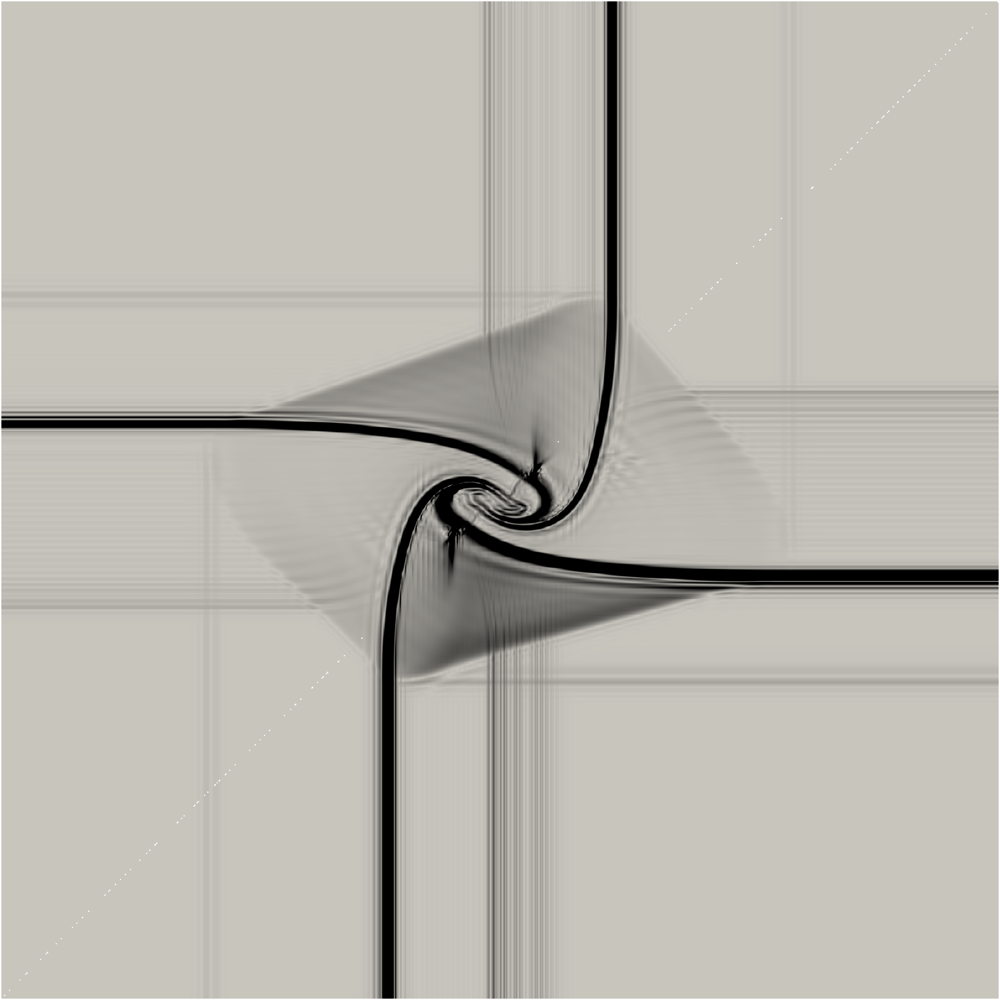
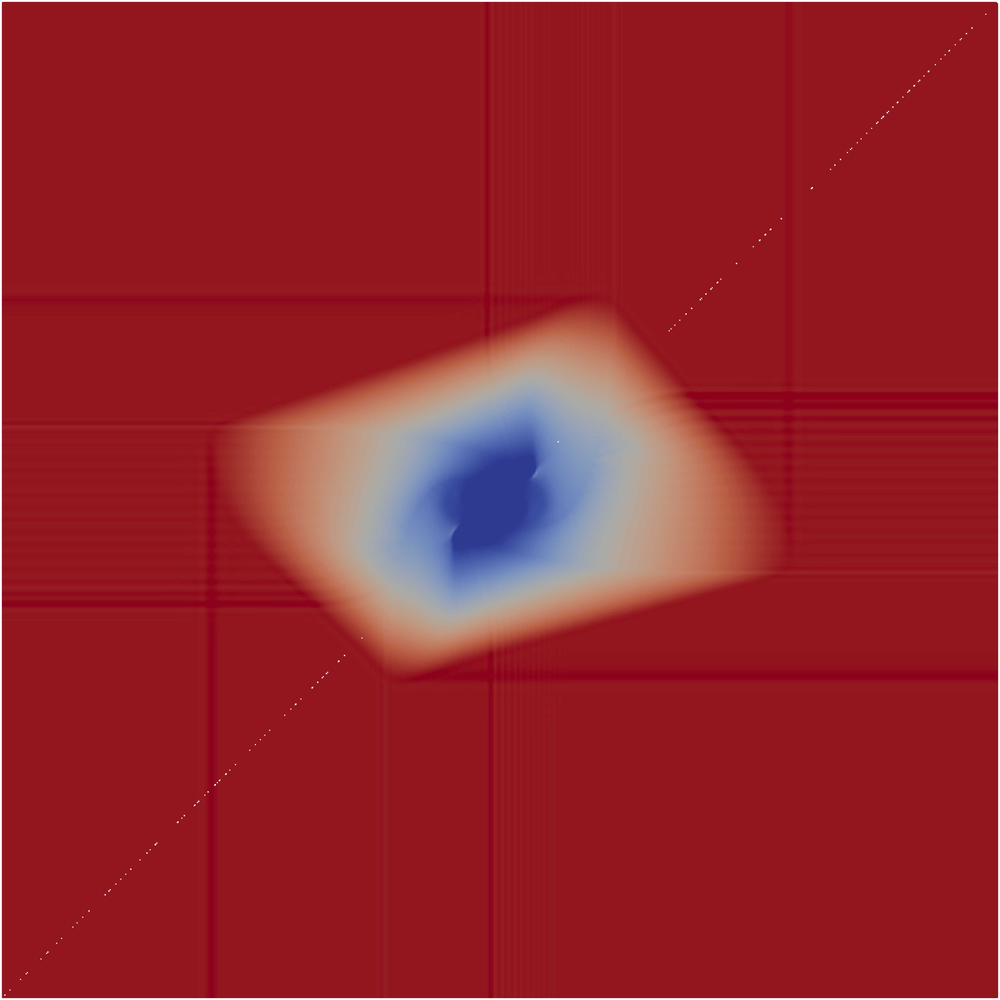
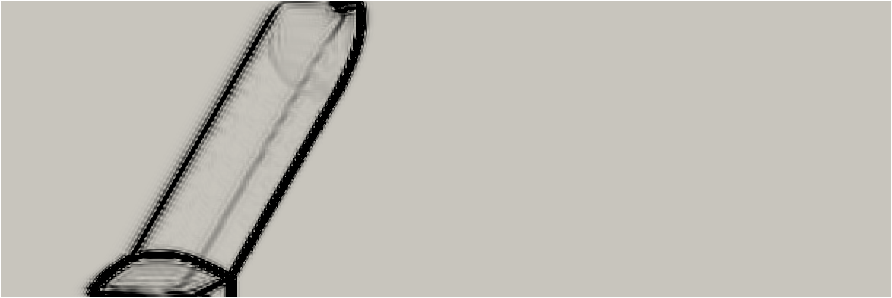

<p align="center">
  
</p>

<h1 align="center">FRForge</h1>

<p align="center">
  <strong>A laboratory for inventing and quantitatively evaluating<br />high-order shock-capturing methods in Flux Reconstruction</strong>
</p>

<p align="center">
  First-principles FR · pluggable capturing hooks · scored invent loop<br />
  for the <strong>compressible Euler equations</strong>
</p>

<p align="center">
  
  
  
  <a href="https://github.com/RcktMan77/FRForge/actions"></a>
</p>

<p align="center">
  <em>Science-first overview below · setup and CLI under Getting started</em>
</p>

---

## Table of contents

- [Why FRForge?](#why-frforge)
- [The problem](#the-problem)
- [Approach](#approach)
- [Numerical schemes](#numerical-schemes)
- [Test cases](#test-cases)
- [How methods are judged](#how-methods-are-judged)
- [Getting started](#getting-started)
- [Adding a new capturing method](#adding-a-new-capturing-method)
- [Further documentation](#further-documentation)
- [License](#license)

---

## Why FRForge?

High-order FR/DG schemes shine in smooth flow and struggle at shocks. FRForge treats **discontinuity treatment** as the research object: not only whether a scheme runs, but whether a proposed sensor, artificial viscosity, hybrid reconstruction, or limiter improves on a classical baseline without destroying formal accuracy.

| | |
|:--|:--|
| **Core** | First-principles Flux Reconstruction (1D / 2D quads, curved optional) |
| **Research object** | Pluggable capturing methods (`src/methods/`), not a black-box CFD stack |
| **Scoring** | Machine-readable JSON: order, dissipation, shock quality, robustness |
| **Invent scheme** | Frozen **GL + Rusanov + SSP-RK3** so composites stay comparable |
| **CI** | Ubuntu · Julia 1.10 / 1.11 · light suites (~10–15 min) |

<!-- Prefer $...$ math in Markdown. Inside raw HTML (feature strip), use HTML subscripts. -->
<table>
  <tr>
    <td width="25%" align="center" valign="top">
      <strong>FR core</strong><br />
      <small>GL/GLL points, g<sub>DG</sub>, Rusanov/HLLC, SSP-RK</small>
    </td>
    <td width="25%" align="center" valign="top">
      <strong>Hooks</strong><br />
      <sub>Sense, dissipate, limit—without forking the residual</sub>
    </td>
    <td width="25%" align="center" valign="top">
      <strong>Scores</strong><br />
      <sub>Order · dissipation · shock · robustness → composite</sub>
    </td>
    <td width="25%" align="center" valign="top">
      <strong>Lab memory</strong><br />
      <sub>Experiment log · confirm · snapshots</sub>
    </td>
  </tr>
</table>

---

## The problem

High-order discontinuous schemes—Flux Reconstruction (FR), discontinuous Galerkin (DG), and spectral difference methods—deliver excellent accuracy when the solution is smooth. At shocks and contacts, polynomial representations produce Gibbs-type oscillations that can destroy positivity of density and pressure.

Classical remedies (limiters, filtering, **element-local artificial viscosity** guided by a modal sensor) work in practice but leave hard trade-offs:

- Viscosity strong enough for robustness often **over-dissipates** post-shock entropy waves.
- Sensors and scales that work on one mesh or degree may fail on another.
- Hybrid reconstructions can restore sharpness yet compromise **formal order** if careless.
- Literature comparisons mix codes, meshes, time integrators, and “looks good” criteria.

What is still scarce is a **systematic laboratory**: a fixed high-order FR discretization, a clear hook surface for *structurally new* methods, and a quantitative suite that scores order, excess dissipation, shock quality, and robustness against a documented baseline.

**Goal:** produce methods that improve the measured order–dissipation–shock trade-off relative to classical Persson AV under a fixed FR discretization.

---

## Approach

1. **Green-field FR core** — Solution points, $g_{DG}$ correction, interface fluxes, and SSP-RK in pure Julia (no external FR library dependency).
2. **Pluggable capturing** — Hooks: `preprocess_state!`, interface extrapolation, optional flux override, `sense!`, `apply_dissipation!`, `post_step!`. New methods are real code under `src/methods/`.
3. **Quantitative scoring** — Versioned JSON reports; invent classifies candidates against `persson_av`.
4. **Laboratory loop** — Experiment log, frontier analytics, fine-mesh `confirm`, reproducibility snapshots. Invent scheme stays frozen unless a re-baseline is logged.

Blueprints: [`docs/design.md`](docs/design.md). Publication VTU/ParaView path: [`docs/visualization.md`](docs/visualization.md).

---

## Numerical schemes

### Spatial discretization

FRForge uses **Flux Reconstruction** on tensor-product elements (1D; 2D quads, optional isoparametric curves).

| Axis | Default (invent / scoring) | Also available |
|------|----------------------------|----------------|
| Solution points | **Gauss–Legendre (GL)** | Gauss–Lobatto–Legendre (GLL) |
| Correction | Huynh $g_{DG}$ (Legendre/Radau) | — (core fixed) |
| Interface flux | **Rusanov** (local Lax–Friedrichs) | **HLLC** (Euler) |
| Time | **SSP-RK3** | SSP-RK2 |

On GL nodes with $g_{DG}$, the scheme recovers a DG-equivalent FR formulation (Huynh). GLL / HLLC / SSP-RK2 are for **robustness and exploration**; invent composite history stays on **GL + Rusanov + SSP-RK3**.

**References:** Huynh (AIAA 2007-4079); Vincent–Castonguay–Jameson (energy-stable FR); Rusanov; Toro (HLLC); Gottlieb–Shu (SSP-RK).

### Reference capturing method

Honest invent baseline: classical **Persson-style modal sensor + element-local AV** (`persson_av`)—mild and transparent, not a heavily tuned champion:

- Modal (Legendre) smoothness indicator $\sigma$ per element.
- Element viscosity $\varepsilon \propto c_{\mathrm{av}}\,\sigma\,(h/p)\,\lambda_{\max}$ via BR0-style (or local) dissipation (1D/2D).

`scaled_persson` is a composition demo with elevated $c_{\mathrm{av}}$. `NullCapturing` is for smooth order and excess-dissipation references.

**Reference:** Persson & Peraire, AIAA 2006-112.

---

## Test cases

**Coarse / CI-light** meshes support fast screening and required CI. Short-listed methods should be **confirmed on finer meshes** before strong claims.

### Smooth order and conservation

| Case | What it stresses |
|------|------------------|
| 1D linear advection (periodic) | Formal spatial order; mass conservation |
| 1D Euler density wave | Smooth Euler order; multi-component conservation |
| 2D Euler / advection | Multi-D tensor-product order |
| Isentropic vortex (Yee-type) | Smooth multi-D Euler with exact solution |
| Periodic conserved integrals | Conservation residuals near machine precision |

### 1D discontinuous

| Case | What it stresses |
|------|------------------|
| **Sod** shock tube | Shock, contact, rarefaction; overshoot; thickness; positivity |
| **Shu–Osher** | Shock–entropy waves—classic excess-dissipation test |

Shu–Osher is **most stable at lower $p$** with the present AV + explicit SSP-RK (the quant suite uses $p = 1$ as the robust start); higher $p$ Shu–Osher is a stress test, not a routine CI gate.

### 2D discontinuous

| Case | What it stresses |
|------|------------------|
| **Lax–Liu 2D Riemann** (esp. **cfg 6**) | Multi-wave contacts/shears |
| **Reduced Double-Mach-like** | Inclined shock + reflecting wall (optional/full tier) |
| **Reduced forward-facing step** | Solid wall / step (optional tier) |
| Jumps on curved quads | Capturing + geometry |

<p align="center">
  
  
</p>
<p align="center">
  <sub><strong>Left:</strong> numerical Schlieren $|\nabla\rho|$ (white→black). &nbsp; <strong>Right:</strong> pressure.</sub>
</p>
<p align="center">
  <em>Figure: 2D Riemann problem (Lax–Liu configuration 6), documentation baseline with <code>persson_av</code> (presentation mesh $192\times 192$, $p=2$, $t=0.15$); not invent/CI-light resolution. High-order VTU + ParaView tessellate/resample — see <a href="docs/visualization.md">docs/visualization.md</a>.</em>
</p>

<p align="center">
  
</p>
<p align="center">
  
</p>
<p align="center">
  <sub><strong>Top:</strong> numerical Schlieren $|\nabla\rho|$ (white→black). &nbsp; <strong>Bottom:</strong> pressure.</sub>
</p>
<p align="center">
  <em>Figure: Reduced Double-Mach-like configuration (inclined shock + reflecting wall), documentation baseline with <code>persson_av</code> (presentation mesh $280\times 100$, $p=1$, $t=0.08$). Same pipeline as the Riemann figures; optional/full CI tier for the short reduced case — see <a href="docs/visualization.md">docs/visualization.md</a>.</em>
</p>

### Supporting checks

| Check | Role |
|-------|------|
| Positivity of $\rho$ and $p$ | Hard gate on Euler discontinuous runs |
| Freestream preservation | Cartesian and **curved** quads |
| BC freestream | Transmissive / Dirichlet paths |
| Robustness matrix | Scheme axes beyond invent defaults |

**Problem refs:** Sod (1978); Shu–Osher (1989); Lax–Liu (1998); Woodward–Colella (1984); Yee–Sandham–Djomehri vortex setup (1999).

---

## How methods are judged

### Score components

| Score | Weight | Meaning |
|-------|--------|---------|
| **Order preservation** | 0.30 | Smooth-order gates (binary in absolute scoring) |
| **Dissipation** | 0.25 | Low excess dissipation vs exact / `NullCapturing` |
| **Shock quality** | 0.25 | Thickness (SP spacings) and overshoot |
| **Robustness** | 0.20 | No divergence/NaNs; positivity where required |
| **Composite** | — | Weighted sum |

Relative maps vs baseline and an **order-vs-dissipation trade-off** apply on invent.

### Candidate status (coarse invent)

| Status | Meaning |
|--------|---------|
| `rejected` | Hard gates failed |
| `pass_gates` | Valid, but composite margin below $\delta$ (default $0.02$) or trade-off failed |
| `promising` | Composite beats baseline by at least $\delta$ and trade-off OK |
| `accepted_candidate` | `promising` **and** HO VTK produced |

Publication-grade narrative also wants **hypothesis/lessons**, robustness evidence, and **fine-mesh confirm**—not only a green coarse invent JSON.

### Fine-mesh confirmation

1. Short-list on **coarse invent** (`frforge invent`) — owns composite history.  
2. **`frforge confirm`** — denser multi-D mesh (Riemann cfg 6, reduced DMR, optional vortex).  
3. Paper freeze: `frforge snapshot freeze … --require-confirm`.

| Confirm status | Meaning |
|----------------|---------|
| `confirmed` | Fine-mesh gates + competitiveness vs baseline |
| `confirmation_failed` | Fail / order regression / baseline unfinished |

Confirm **does not rewrite** invent composites. Default preset ~10–30 min class; `--preset presentation` is paper-grade (hours).

### Threading

**Invent / quant / official confirm use serial residual (bit-deterministic).**  
`FRFORGE_THREADS` / docs `--threads` are for local long VTU runs only—not invent score history.

---

## Getting started

### Requirements

- Julia **≥ 1.10** (tested on 1.11.x)
- Git  
- **CI:** Ubuntu · Julia 1.10 + 1.11 · light suites. Heavy presentation VTUs and full robustness matrices are local/nightly, not required CI.

### Setup

```bash
git clone https://github.com/RcktMan77/FRForge.git
cd FRForge
julia --project=. -e 'using Pkg; Pkg.instantiate()'
chmod +x bin/frforge
```

### Essential commands

```bash
# Quantitative suite (scored JSON)
./bin/frforge test --suite quant --method persson_av --report results/quant/report.json

# Invent vs Persson baseline (coarse; score history)
./bin/frforge invent --method scaled_persson --baseline persson_av --report-dir results/invent

# After short-list: fine-mesh confirm (local)
./bin/frforge confirm --method scaled_persson --baseline persson_av

# Light 2D / curved / benchmarks
./bin/frforge test --suite 2d --report results/2d/report.json
./bin/frforge test --suite curved --report results/curved/report.json
./bin/frforge test --suite benchmarks --report results/bench/report.json

# Log analytics
./bin/frforge log summary
./bin/frforge log frontier

# Optional: coefficient scout (does not append invent log)
./bin/frforge tune --method scaled_persson --values 0.05,0.1,0.2,0.5

# High-order VTU (ParaView ≥ 5.5 recommended)
./bin/frforge run --case euler_density_wave --p 3 --ne 16 --output results/euler.vtu
```

Full CLI: `./bin/frforge --help`. Tests: `julia --project=. -e 'using Pkg; Pkg.test()'`.

---

## Adding a new capturing method

1. Implement `AbstractCapturingMethod` hooks in `src/methods/MyMethod.jl` (override only what you need).
2. `include` + `register_method!("my_method", …)` in [`src/methods/Registry.jl`](src/methods/Registry.jl).
3. `./bin/frforge invent --method my_method --baseline persson_av`
4. Inspect `candidate_status`; for promising+, write real **hypothesis/lessons** in the experiment log.
5. If short-listed: `./bin/frforge confirm --method my_method`, then robustness as needed.
6. Paper freeze: `frforge snapshot freeze … --require-confirm`.

Structural novelty (new sensors, operators, hybrids) is the primary research goal; coefficient-only search is secondary.

---

## Further documentation

| Document | Content |
|----------|---------|
| [`docs/design.md`](docs/design.md) | Architecture, hooks, JSON schema, scoring, historical plan |
| [`docs/visualization.md`](docs/visualization.md) | Local HO VTU + ParaView figures |
| [`docs/reproduce_method_template.md`](docs/reproduce_method_template.md) | Reproduce a short-listed method |
| [`research/experiment_log.md`](research/experiment_log.md) | Laboratory notebook |

### Capability snapshot

| Area | Status |
|------|--------|
| 1D/2D FR (GL/GLL), Rusanov/HLLC, SSP-RK2/3 | Implemented |
| `persson_av` + invent registry | Implemented |
| Quant suite + invent classification | Implemented |
| HO VTK (discontinuous Lagrange) | Implemented |
| Curved quads + freestream gate | Implemented |
| 2D Riemann, vortex, optional DMR/FFS | Implemented (tiered CI) |
| Experiment log, confirm, snapshots, tune | Implemented |

---

## License

[MIT](LICENSE) © 2026 RcktMan77

If you use FRForge in research, please cite this repository and the classical references for the schemes and test problems you rely on. Contributions of new capturing methods with scored invent reports and clear experiment-log lessons are especially welcome.
