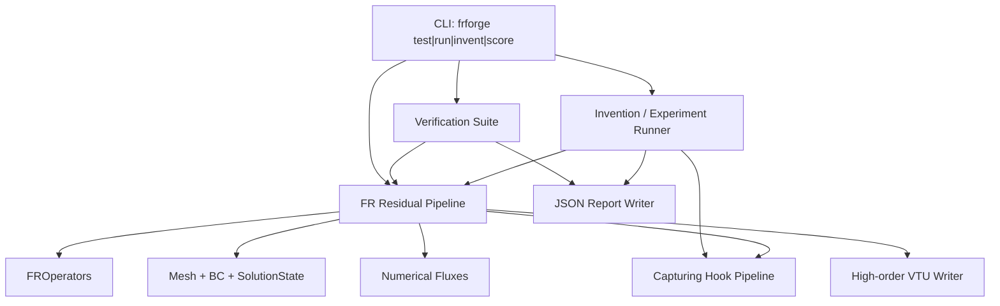
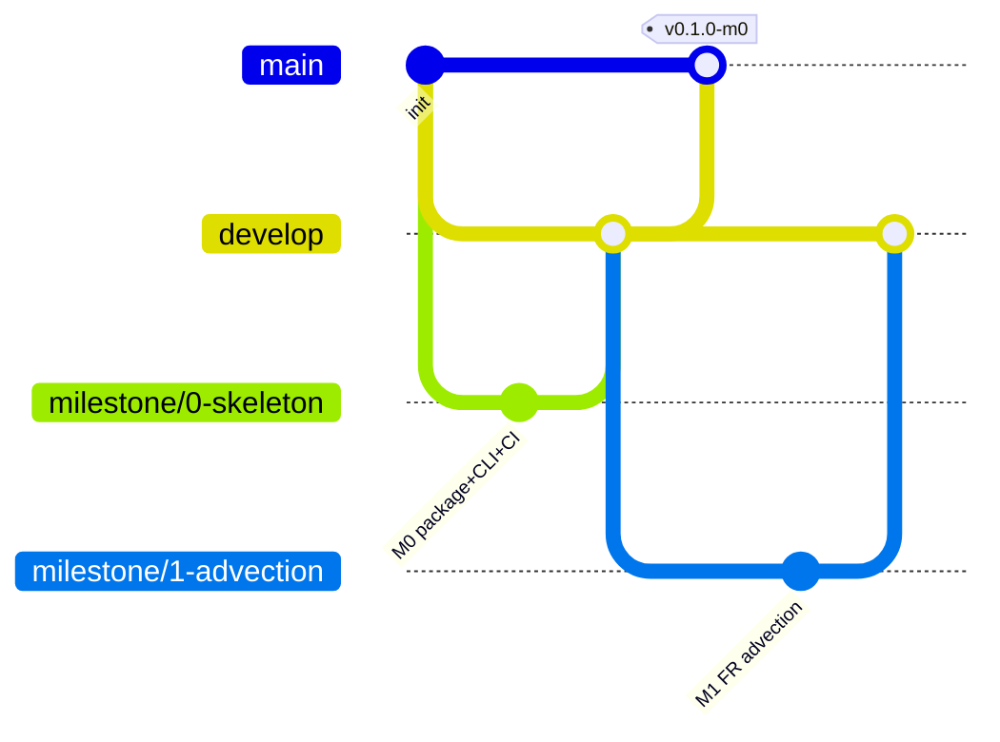

# FRForge Design Document

| Field | Value |
|-------|--------|
| **Title** | FRForge — High-Order Flux Reconstruction Laboratory |
| **Author** | FRForge maintainers (RcktMan77) |
| **Date** | 2026-08-03 |
| **Status** | Approved (with plan-review incorporation, 2026-08-03) |
| **Repository** | https://github.com/RcktMan77/FRForge.git |
| **Local path** | `/Users/zdavis/Desktop/FRForge` |
| **Language / runtime** | Julia ≥ 1.10 (tested on 1.11.7) |
| **License** | MIT |

---

## Overview

FRForge is a green-field, self-contained Julia package that implements Flux Reconstruction (FR) schemes for hyperbolic conservation laws, with the primary purpose of inventing and quantitatively evaluating novel shock-capturing / discontinuity-treatment methods. The laboratory is deliberately narrow: start from first-principles 1D FR, enforce machine-readable verification at every step, and keep discontinuity treatment fully pluggable so agents can propose structurally new methods (sensors, residual dissipation, interface reconstruction/limiting, hybrid schemes) rather than only tuning coefficients of a single heuristic.

This document is the implementation blueprint. It fixes package layout, FR operator conventions (including explicit \(g_{DG}\) construction), mesh/state/BC representations, a staged residual hook pipeline for capturing, JSON report schemas with a locked agent scoring contract, CLI surface, high-order VTK strategy (ParaView-safe node ordering), agent invention workflow, Git branching, and an ordered PR plan mapping milestones 0–8. An engineer or agent should be able to implement Milestone 0 immediately from this document and proceed through later milestones without architectural rework.

---

## Background & Motivation

### Problem

High-order FR/CPR schemes achieve excellent accuracy in smooth regions but produce Gibbs-type oscillations near discontinuities. Classical remedies (modal sensors + artificial viscosity, limiters, hybrid schemes) are numerous and hard to compare fairly. Research often mixes implementation details with algorithmic claims, making it difficult for humans or agents to:

1. Propose a **structurally novel** capturing method (new sensor family, new reconstruction/dissipation operator, hybrid switching logic, interface limiting).
2. Measure it against a fixed suite: formal order, excess dissipation, shock quality, overshoots, positivity, conservation.
3. Decide autonomously whether the candidate is better than a classical baseline.

### Current state

- Repository exists with a single initial commit (`d500456`) containing only a two-line `README.md`.
- No solver code, no package skeleton, no CI.
- Remote: `git@github.com:RcktMan77/FRForge.git`; branch `main` only.
- Local tree verified: only `README.md`; no existing solver architecture to reuse or contradict.

### Pain points this design addresses

| Pain | Design response |
|------|-----------------|
| Hidden solver coupling to one capturing method | Staged residual hooks; core never imports a concrete method by name |
| Manual visual scoring only | JSON reports with locked metrics + scored summary for agents |
| “Black box” high-order codes | First-principles FR; clarity over performance early |
| Premature 2D / library reuse | Hard 1D milestones first; no external high-order CFD libs |
| Unclear invention path for agents | `src/methods/` registry + invent/score CLI + experiment runner |
| Non-periodic benchmarks (Sod, Shu–Osher) | Explicit `AbstractBC` + ghost-state residual path |

---

## Goals & Non-Goals

### Goals

1. Implement FR from first principles (solution points, interface corrections, lifting) in pure Julia.
2. Solve 1D linear advection, inviscid Burgers, and compressible Euler with SSP-RK3 and explicit BCs.
3. Provide a **staged, pluggable discontinuity-treatment pipeline** (preprocess, interface extrapolation, flux override, sense+dissipate, post-step) with a Persson-style AV baseline.
4. Ship a quantitative verification suite with machine-readable JSON reports and a stable agent scoring contract.
5. Enable agent-driven invention of new methods with automated scoring vs baseline.
6. Provide robust high-order VTU/VTK output for ParaView (1D prep → 2D primary use).
7. Extend FR + suite + VTK to 2D (Cartesian / simple quads) after the 1D invention loop is solid.
8. Enforce milestone discipline: runnable code + passing verification before the next milestone.

### Non-Goals (explicit)

- Not a production multi-physics CFD code (no Navier–Stokes, chemistry, turbulence models in early milestones).
- Not performance-oriented initially (no GPU, no aggressive SIMD, no MPI).
- No reuse of personal or external high-order FR/DG libraries (Trixi.jl, StartUpDG.jl, etc. may be read for ideas only; not depended on).
- No curved-element / high-order geometry support until later milestones.
- No adaptive mesh refinement (AMR) in milestones 0–8.
- Not a full GUI; CLI + JSON + ParaView only.
- Not a Bayesian/coefficient-tuning lab as the primary invent path (structural code against hooks is primary; coefficient search is secondary).

---

## Key Decisions

| # | Decision | Rationale |
|---|----------|-----------|
| K1 | **Single package `FRForge.jl`** with **flat `include`s** into one module (no nested submodules for M0–M7) | Simplest for green-field research; one `Project.toml`, one export surface |
| K2 | **Concrete 1D types first** (`Mesh1D`, `SolutionState{T,Neq}`); introduce `AbstractMesh{D}` / dimension param only in **M8** when 2D lands. 2D state layout locked to `(Np, Np, Nel, Neq)` | Avoids fake abstraction in M1; no competing 2D layouts |
| K3 | **GL solution points; discontinuous flux at SPs; continuous flux via left/right interface corrections at \(\xi=\pm 1\)** (Huynh FR / DG recovery via \(g_{DG}\)). GLL collocation is **not** the default; optional later `PointSet` | Matches standard FR verification; avoids false “GLL flux-point” scheme |
| K4 | **Reference-element operators built once** (`FROperators{T}` with field `p::Int`) and reused | Clarity, testability, fixed discrete operators |
| K5 | **Staged residual hook pipeline** (preprocess → extrapolate → numerical flux → volume FR → sense/dissipate → post-step); core never names concrete methods | Supports residual-additive **and** reconstruction/limiter/hybrid families without forking residual |
| K6 | **Split types within the pipeline**: sensor + dissipation for AV family; replaceable extrapolate/flux/post-step for structural novelty | Sensor/dissipation composition remains natural; hooks cover hybrid FR–WENO-class methods |
| K7 | **JSON schema versioned** with normative field tables, locked default scoring weights, and key-list validator | Stable agent contract |
| K8 | **Minimal dependencies**: stdlib + `JSON.jl` + `ArgParse.jl`; custom high-order VTU writer | Fewer moving parts |
| K9 | **CLI binary name `frforge`** via shell wrapper + `src/cli/` | Easy for agents; no registry needed early |
| K10 | **Agent methods live only under `src/methods/`** (registry + include). `research/` is notebooks/scripts only, never scored by invent | Single CI-visible invent surface |
| K11 | **Git: create `develop` at M0; `main` protected; `milestone/*` / `feature/*` for work** | Mandatory workflow; never commit directly to `main` |
| K12 | **Conservative variables as primary state**; primitives for sensors/I/O only | Correct Euler numerics |
| K13 | **High-order VTK via VTU XML Lagrange cells** with **discontinuous per-element point clouds** and documented VTK node order | ParaView shows true HO fields and inter-element jumps |
| K14 | **SSP-RK3 (Shu–Osher)** as sole early time integrator (no OrdinaryDiffEq) | Clarity; standard for hyperbolic capturing tests |
| K15 | **Explicit `AbstractBC`** from M3 (usable earlier): `Periodic`, `Transmissive`, `Dirichlet` | Required for Sod/Shu–Osher; conservation metrics defined per BC class |
| K16 | **Julia compat `≥ 1.10`**; CI and local test on 1.11.7; **commit `Manifest.toml` from end of M0** | Reproducible env; LTS-friendly floor |
| K17 | **Rusanov default numerical flux**; HLL deferred (no `HLL.jl` until a PR needs it) | Avoid dead code paths |
| K18 | **Baseline AV in conservative viscous-flux form**; element-scalar \(\sigma_e\); density modes for Euler sensor | Conservation scoring remains meaningful with capturing on |
| K19 | **CI: Ubuntu primary/blocking**; macOS first-class for local dev; optional non-blocking macOS GHA later | Free-tier reliability; portable deps |
| K20 | **Shu–Osher reference: self-converged fine-grid NullCapturing (or trusted) scheme + published sanity check + hash** | Do not rely solely on external tables |
| K21 | **Promising method criteria + JSON status field** for invent/score | Agents and humans share a clear success definition |
| K22 | **Order studies at least \(p\in\{2,3,4\}\)** with several mesh sizes | Robust observed-order evidence |
| K23 | **Excess dissipation primarily relative to NullCapturing** on same mesh/time; absolute entropy secondary | Fair order-vs-dissipation trade-off |

---

## Proposed Design

### High-level architecture



### Package structure

```
FRForge/
├── .gitignore
├── LICENSE
├── README.md
├── Project.toml
├── Manifest.toml              # committed from end of M0
├── .github/workflows/ci.yml   # Julia test on PR to develop/main
├── bin/
│   └── frforge                # executable shell wrapper
├── src/
│   ├── FRForge.jl             # single module; flat includes
│   ├── cli/
│   │   └── main.jl
│   ├── mesh/
│   │   ├── Mesh1D.jl
│   │   ├── BoundaryConditions.jl
│   │   └── Mesh2D.jl          # M8
│   ├── fr/
│   │   ├── Points.jl
│   │   ├── Operators.jl
│   │   ├── Correction.jl      # g_DG only in M0–M7; g_Ga later milestone
│   │   └── Residual.jl        # residual!, interface fluxes, trace assembly (1D)
│   ├── equations/
│   │   ├── AbstractEquation.jl
│   │   ├── LinearAdvection.jl
│   │   ├── Burgers.jl
│   │   └── Euler.jl
│   ├── flux/
│   │   └── Rusanov.jl         # HLL added only when needed
│   ├── time/
│   │   └── SSP_RK3.jl
│   ├── capturing/
│   │   ├── Interfaces.jl      # full hook pipeline + nulls
│   │   └── PerssonAV.jl       # M4 baseline
│   ├── methods/
│   │   └── Registry.jl        # invent methods: file + include + register
│   ├── verification/
│   │   ├── Metrics.jl
│   │   ├── Cases.jl
│   │   ├── Report.jl
│   │   └── schema_keys.jl     # required/optional key validator
│   ├── invent/
│   │   ├── Experiment.jl
│   │   └── Scoring.jl
│   ├── io/
│   │   └── VTKHighOrder.jl
│   └── solvestate/
│       └── SolutionState.jl
├── test/
│   ├── runtests.jl
│   ├── test_operators.jl
│   ├── test_advection.jl
│   ├── test_burgers.jl
│   ├── test_euler.jl
│   ├── test_bc.jl
│   ├── test_capturing.jl
│   ├── test_report_schema.jl
│   ├── test_vtk.jl
│   └── data/                  # shipped reference CSVs (Shu–Osher, …)
│       └── README.md          # provenance
├── research/                  # notebooks/scripts only — NOT invent-scored
│   └── experiments/
└── results/                   # local run artifacts (gitignored)
    └── .gitkeep               # optional; directory documented, contents ignored
```

### Module organization (flat includes)

**Normative:** All source files are **flat-included** into the single module `FRForge`. There are **no nested `module` blocks** for M0–M7.

```julia
module FRForge

using LinearAlgebra, Printf, Dates, Logging
using JSON
using ArgParse

# dependency order
include("fr/Points.jl")
include("fr/Correction.jl")
include("fr/Operators.jl")
include("mesh/BoundaryConditions.jl")
include("mesh/Mesh1D.jl")
include("solvestate/SolutionState.jl")
include("equations/AbstractEquation.jl")
include("equations/LinearAdvection.jl")
include("equations/Burgers.jl")
include("equations/Euler.jl")
include("flux/Rusanov.jl")
include("capturing/Interfaces.jl")   # null hooks from M1
include("fr/Residual.jl")            # residual!; needs ops, mesh, eq, capturing
include("time/SSP_RK3.jl")
# M4+: include("capturing/PerssonAV.jl")
include("methods/Registry.jl")
include("verification/schema_keys.jl")
include("verification/Metrics.jl")
include("verification/Cases.jl")
include("verification/Report.jl")
include("invent/Scoring.jl")
include("invent/Experiment.jl")
include("io/VTKHighOrder.jl")
include("cli/main.jl")

export Mesh1D, FROperators, SolutionState, build_operators
export AbstractBC, PeriodicBC, TransmissiveBC, DirichletBC
export LinearAdvection1D, Burgers1D, Euler1D
export residual!, ssp_rk3!, ssp_rk3_step!
export AbstractCapturingMethod, NullCapturing
export AbstractShockSensor, AbstractDissipationOperator
export NullSensor, NullDissipation
export run_verification, write_report
export write_vtu_high_order
export main_cli

end # module
```

**Invent checklist for agents (M6):**

1. Create `src/methods/MyMethod.jl` implementing the relevant hook types.
2. Add `include("methods/MyMethod.jl")` in `FRForge.jl` (or from `Registry.jl` if preferred single include point).
3. Register in `METHOD_REGISTRY` in `Registry.jl`.
4. Run `frforge invent --method my_method --baseline persson_av --report results/my_method.json`.
5. New scored methods are always a source change (file + registry)—not a runtime plugin load.

---

### FR operator design (1D)

#### Reference element

- Reference interval: \(\xi \in [-1, 1]\).
- Polynomial degree \(p\); \(N_p = p+1\) solution points per element.
- **Solution points** \(\xi_j\), \(j=1,\ldots,N_p\): Gauss–Legendre (GL) nodes of order \(p+1\).
- **Discontinuous flux** \(f^h\) is evaluated at solution points.
- **Interface corrections** use the element endpoints \(\xi = \pm 1\) only (Huynh FR). This is **not** a collocation scheme on GLL flux points of size \(p+1\).

Optional later research: `PointSet` enum (`GL`, `GLL`) — **not implemented in M1**.

#### Discrete operators

```julia
struct FROperators{T}
    p::Int
    ξ::Vector{T}              # GL SPs, length Np = p+1
    w::Vector{T}              # GL weights on [-1,1]
    D::Matrix{T}              # d/dξ at SPs, (Np, Np)
    ℓ_L::Vector{T}            # Lagrange basis at ξ=-1
    ℓ_R::Vector{T}            # Lagrange basis at ξ=+1
    gL_ξ::Vector{T}           # g'_DG,L(ξ_j)
    gR_ξ::Vector{T}           # g'_DG,R(ξ_j)
end

function build_operators(p::Int; T::Type=Float64)::FROperators{T}
    ...
end
```

**Construction algorithm:**

1. Compute GL nodes/weights of order \(p+1\) (Golub–Welsch / stable recurrence) in `Points.jl`.
2. Build Lagrange basis on SPs; \(D_{ij} = \ell_j'(\xi_i)\).
3. Evaluate \(\ell_j(\pm 1)\) for interface extrapolation.
4. Build \(g'_{DG,L}\), \(g'_{DG,R}\) at SPs via **Appendix C** (Legendre/Radau construction).

#### Normative residual (1D, inviscid, single equation)

**Meaning of \(\hat{f}\):** \(\hat{f}_L\) and \(\hat{f}_R\) are the **common numerical physical fluxes** at the left and right interfaces of the element (scalar flux \(f\), not \(f\cdot n\)). In 1D the interface is a point; left and right elements sharing an interface both use the **same** numerical flux value \(\hat{f}\) computed from \((u^-, u^+)\).

On element \(e\) with Jacobian \(J_e = \Delta x_e / 2\), at solution point \(j\):

\[
\frac{\partial u_{j,e}}{\partial t}
= -\frac{1}{J_e}\Biggl[
  \sum_{k=1}^{N_p} D_{jk}\, f_{k,e}^{h}
  + \bigl(\hat{f}_{L,e} - f^{h}_{L,e}\bigr)\, (g'_{L})_{j}
  + \bigl(\hat{f}_{R,e} - f^{h}_{R,e}\bigr)\, (g'_{R})_{j}
\Biggr]
\]

where

\[
f^{h}_{L,e} = \sum_{k} f_{k,e}^{h}\,\ell_k(-1),\qquad
f^{h}_{R,e} = \sum_{k} f_{k,e}^{h}\,\ell_k(+1).
\]

For systems, apply componentwise with vector fluxes / vector numerical fluxes.

**Index-form residual for implementers (element \(e\), point \(j\), equation \(c\)):**

```text
vol[j,c]   = sum_k D[j,k] * f[k,e,c]
corr[j,c]  = (fhat_L[c] - fL[c]) * gL_ξ[j]
           + (fhat_R[c] - fR[c]) * gR_ξ[j]
du[j,e,c]  = -(vol[j,c] + corr[j,c]) / J[e]
```

**Mandatory operator unit tests (M1):**

| Test | Oracle |
|------|--------|
| Poly differentiation | For \(u=\xi^k\), \(k\le p\), \(Du\) exact within ~1e-13 |
| \(g_L,g_R\) endpoints for \(p=1..5\) | \(g_L(-1)=1\), \(g_L(+1)=0\), \(g_R(-1)=0\), \(g_R(+1)=1\) within `1e-12`; finite derivatives |
| Periodic advection conservation | Relative mass change \(\le 1\mathrm{e}{-12}\) after fixed time |
| Formal order | Smooth advection L2 order \(\ge (p+1)-0.3\) |
| Weak-form residual agreement (optional but recommended) | For linear advection, strong-form FR residual matches DG strong form recovered via integration by parts on one element within roundoff |

---

### Mesh, boundary conditions, and solution state

#### Mesh1D

```julia
struct Mesh1D{T}
    n_elements::Int
    x_vertices::Vector{T}     # length n_elements+1, strictly increasing
    Δx::Vector{T}
    J::Vector{T}              # Δx/2
    left_bc::AbstractBC
    right_bc::AbstractBC
end

function Mesh1D(x_left, x_right, n_elements;
                left_bc::AbstractBC=PeriodicBC(),
                right_bc::AbstractBC=PeriodicBC())
    # If either side is PeriodicBC, both must be PeriodicBC (enforced).
end
```

`periodic` is **not** a separate bool; periodicity is expressed by `PeriodicBC` on both ends.

#### Boundary conditions (normative)

```julia
abstract type AbstractBC end

struct PeriodicBC <: AbstractBC end

"""Transmissive / zero-order extrapolation: ghost state = interior trace at domain end."""
struct TransmissiveBC <: AbstractBC end

"""Dirichlet: prescribed conserved state (or callable of t)."""
struct DirichletBC{F} <: AbstractBC
    u_func::F   # u_func(t) -> SVector/NTuple/Vector of length Neq
end
```

**Ghost / interface algorithm in residual steps 1–2:**

1. For each element, extrapolate left/right traces \(u_L^h\), \(u_R^h\) from SPs via \(\ell(\pm 1)\).
2. Build unique interface list:
   - **Interior interface** between \(e\) and \(e+1\): left state = \(u_R^{h,(e)}\), right state = \(u_L^{h,(e+1)}\).
   - **Domain left** (\(x=x_{\min}\)):
     - `PeriodicBC`: left state = \(u_R^{h,(N_{el})}\), right state = \(u_L^{h,(1)}\).
     - `TransmissiveBC`: ghost \(u^- = u_L^{h,(1)}\) (both sides of flux use interior trace → zero numerical dissipation at boundary for Rusanov when \(u^-=u^+\); physical flux \(F(u)\) consistent with free outflow for 1D Euler tests).
     - `DirichletBC`: ghost \(u^- = u_{\mathrm{bc}}(t)\), interior \(u^+ = u_L^{h,(1)}\).
   - **Domain right**: symmetric.
3. Compute one numerical flux \(\hat{f}\) per interface from \((u^-, u^+)\).
4. Each element picks \(\hat{f}_{L,e}\) and \(\hat{f}_{R,e}\) from the adjacent interface fluxes.

**Default BCs by case:**

| Case | Left BC | Right BC |
|------|---------|----------|
| Periodic sine advection | `PeriodicBC` | `PeriodicBC` |
| Burgers (periodic demo) | `PeriodicBC` | `PeriodicBC` |
| Smooth Euler pulse (periodic domain) | `PeriodicBC` | `PeriodicBC` |
| Sod | `TransmissiveBC` | `TransmissiveBC` |
| Shu–Osher | `TransmissiveBC` | `TransmissiveBC` |

#### SolutionState

```julia
"""
1D layout: u[Np, Nel, Neq]
mesh and ops owned by state to avoid double-sourcing geometry.
"""
mutable struct SolutionState{T, Neq}
    u::Array{T,3}
    t::T
    p::Int
    mesh::Mesh1D{T}
    ops::FROperators{T}
end
```

**M8 2D (locked layout):**

```julia
# u[i, j, e, c] with i,j = 1:Np tensor-product SPs
mutable struct SolutionState2D{T, Neq}
    u::Array{T,4}   # (Np, Np, Nel, Neq)
    t::T
    p::Int
    mesh::Mesh2D{T}
    ops::FROperators{T}  # 1D factors; tensor-product applied in residual
end
```

No `AbstractMesh` until M8; then introduce thin `AbstractMesh{D}` only if it simplifies dispatch—otherwise keep `Mesh1D`/`Mesh2D` concrete.

---

### Equations and fluxes

```julia
abstract type AbstractEquation{Neq} end

struct LinearAdvection1D{T} <: AbstractEquation{1}
    a::T
end

struct Burgers1D <: AbstractEquation{1} end

struct Euler1D{T} <: AbstractEquation{3}
    γ::T  # default 1.4
end
```

**Numerical flux:** Rusanov (local Lax–Friedrichs) for Burgers and Euler:

\[
\hat{f}(u^-,u^+) = \tfrac12\bigl(F(u^-)+F(u^+)\bigr) - \tfrac12\lambda_{\max}(u^+-u^-).
\]

For Euler, \(\lambda_{\max} = \max(|v^-|+c^-, |v^+|+c^+)\). Linear advection uses pure upwind.

**HLL:** not in the tree until a future PR explicitly adds it (K17).

---

### Capturing / discontinuity-treatment hook pipeline

Goals require **structural novelty** (hybrid reconstruction, interface limiting, residual AV, etc.). A residual-only AV hook is insufficient. Normative **staged pipeline** inside `residual!` / time step:

```mermaid
sequenceDiagram
    participant RK as SSP-RK3
    participant R as residual!
    participant H as Capturing hooks
    participant Eq as Flux

    RK->>H: post_step! (previous stage end; optional)
    RK->>R: residual!(du, state, eq, method)
    R->>H: preprocess_state!(u_work, state, method)
    R->>H: extrapolate_interface!(traces, u_work, state, method)
    R->>H: numerical_flux_override or default Rusanov
    R->>R: volume D*f + interface corrections (fixed FR core)
    R->>H: sense!(σ, …); apply_dissipation!(du, σ, …)
    R-->>RK: du
```

```julia
"""Bundle of hooks. Concrete methods override only what they need."""
abstract type AbstractCapturingMethod end

# Fine-grained types (AV family and composition)
abstract type AbstractShockSensor end
abstract type AbstractDissipationOperator end

struct NullSensor <: AbstractShockSensor end
struct NullDissipation <: AbstractDissipationOperator end

"""Default method: identity hooks + null AV. Used from M1 onward."""
struct NullCapturing <: AbstractCapturingMethod
    sensor::NullSensor
    dissip::NullDissipation
end
NullCapturing() = NullCapturing(NullSensor(), NullDissipation())

# --- Hook API (all have no-op defaults on NullCapturing / base fallbacks) ---

"""Optional copy/limit of conserved state before residual (positivity limiters, etc.)."""
function preprocess_state!(u_work, method::AbstractCapturingMethod, state, eq)
    copyto!(u_work, state.u)
end

"""Build left/right traces per element. Override for WENO/hybrid interface reconstruction."""
function extrapolate_interface!(traces, method::AbstractCapturingMethod, u_work, state, eq)
    # default: standard Lagrange ℓ(±1) from FR SPs
end

"""Optional per-interface numerical flux override.

1D signature (normative for M0–M7): no face normal.
Returns the common **physical** numerical flux vector/scalar, or `nothing`
to use the equation default (`numerical_flux(eq, uL, uR)`, e.g. Rusanov).

2D (M8): residual still requests physical flux; the residual multiplies by
the face normal when assembling the normal flux. Override signature gains
an optional face tag only if needed — never return \(f\cdot n\) from this hook.
"""
function numerical_flux_method(method::AbstractCapturingMethod, eq, uL, uR)
    return nothing  # → default numerical_flux(eq, uL, uR)
end

# --- Method-level defaults are true no-ops (monolithic methods need not have .sensor/.dissip) ---

function sense!(σ, method::AbstractCapturingMethod, u_work, state, eq)
    fill!(σ, zero(eltype(σ)))
    return σ
end

function apply_dissipation!(du, method::AbstractCapturingMethod, σ, u_work, state, eq)
    return du  # no-op
end

"""Called after each full RK3 step (not substage) for solution limiting."""
function post_step!(state, method::AbstractCapturingMethod, eq)
    return nothing
end

# --- Fine-grained sensor / dissipation API (AV family; optional composition) ---

function sense!(σ, sensor::AbstractShockSensor, u_work, state, eq)
    fill!(σ, zero(eltype(σ)))
    return σ
end
function sense!(σ, ::NullSensor, u_work, state, eq)
    fill!(σ, zero(eltype(σ)))
    return σ
end

function apply_dissipation!(du, dissip::AbstractDissipationOperator, σ, u_work, state, eq)
    return du
end
function apply_dissipation!(du, ::NullDissipation, σ, u_work, state, eq)
    return du
end
```

**AV-style methods that compose sensor + dissip** override method-level hooks themselves (not via fragile default field access):

```julia
function sense!(σ, method::PerssonAVMethod, u_work, state, eq)
    sense!(σ, method.sensor, u_work, state, eq)
end
function apply_dissipation!(du, method::PerssonAVMethod, σ, u_work, state, eq)
    apply_dissipation!(du, method.dissip, σ, u_work, state, eq)
end
```

**Which families each hook enables:**

| Hook | Structural families |
|------|---------------------|
| `preprocess_state!` | Global/element scaling, positivity fixes before flux |
| `extrapolate_interface!` | Hybrid FR–WENO, MUSCL/TVB interface states, characteristic limiting of traces |
| `numerical_flux_method` | Flux blending, entropy-stable flux swap, HLLC-as-method |
| `sense!` + `apply_dissipation!` | Persson AV, residual filters, element/modal dissipation |
| `post_step!` | Slope/moment limiters applied to \(u^{n+1}\) |

**Fixed FR core (not replaceable without forking):** volume \(D f^h\) + DG correction lifting using \(\hat{f}-f^h\). Novel “change the FR correction polynomial” research would be a later extension (new operator builder), not required for M4–M6.

**Persson baseline (M4)** implements only `sense!` + `apply_dissipation!` via:

```julia
struct PerssonAVMethod{T} <: AbstractCapturingMethod
    sensor::PerssonSensor{T}
    dissip::ElementArtificialViscosity{T}
end
# + method-level sense!/apply_dissipation! forwarding as above
```

**Critical rule:** `residual!` dispatches only on `AbstractCapturingMethod` / hook functions — never `PerssonAVMethod` by name.

**Residual home:** `src/fr/Residual.jl` owns `residual!`, `allocate_traces`, `compute_interface_fluxes` (BC ghosts + numerical flux assembly). Equation-local physical flux stays in `equations/`; Rusanov in `flux/Rusanov.jl`.

#### Locked Persson AV baseline algorithm (M4)

**Sensor field:** density \(\rho\) only for Euler; the scalar solution for advection/Burgers.

**Modal transform on element \(e\):** Legendre Vandermonde on GL nodes:

\[
V_{jk} = P_{k-1}(\xi_j),\quad k=1,\ldots,N_p
\quad\Rightarrow\quad
\hat{u} = V^{-1} u^{(\rho)}_e.
\]

**Modal energy ratio** (Persson–Peraire style):

\[
e_{\mathrm{high}} = \hat{u}_{N_p}^2,\qquad
e_{\mathrm{total}} = \sum_{k=1}^{N_p} \hat{u}_k^2 + \varepsilon_{\mathrm{floor}},
\qquad
s_e = \log_{10}\bigl(e_{\mathrm{high}} / e_{\mathrm{total}}\bigr).
\]

**Smoothness indicator (element-scalar):**

\[
\sigma_e = \frac{1}{1+\exp\bigl(-\kappa(s_e - s_0)\bigr)} \in (0,1),
\qquad
s_0 = -4\log_{10}(p),\quad \kappa = 4\ \text{(scored default)}.
\]

Storage: `σ::Vector{T}` of length `Nel` (not per-point) for the baseline.

**Viscosity:**

\[
\varepsilon_e = c_{\mathrm{av}}\,\sigma_e\,\frac{h_e}{p}\,\lambda_{\max,e},
\quad c_{\mathrm{av}} = 0.5\ \text{(scored default)}.
\]

**Conservative viscous residual (locked for baseline):** add interface-consistent viscous fluxes in BR0/BR1-light form on the reference element:

1. Form viscous flux \(g = \varepsilon_e \cdot (1/J_e) D u\) (gradient at SPs) for each conserved component (or density + momentum + energy with same \(\varepsilon_e\)).
2. BR0: average interface gradients / interior penalty with penalty \(\tau \sim \varepsilon_e (p+1)^2 / h_e\).
3. Add \(+\nabla\cdot g\) contribution in conservative FR form (same correction machinery on viscous numerical fluxes).

**Acceptable M4 simplification if full BR1 is too large for one PR:** element-local

\[
(r_{\mathrm{AV}})_{j,e} = \frac{\varepsilon_e}{J_e^2}\sum_k (D^\top M D \text{ or } D D)_{jk} u_{k,e}
\]

**only if** discrete mass of the viscous term is verified to be \(\sim 0\) on periodic meshes (column sums). Prefer conservative form for scored runs. Document which form is active in JSON `method_params.av_form = "conservative_br0" | "element_local_DD"`.

---

### Time integration

```julia
"""
SSP-RK3 (Shu–Osher):
  u¹ = uⁿ + Δt L(uⁿ)
  u² = 3/4 uⁿ + 1/4 u¹ + 1/4 Δt L(u¹)
  uⁿ⁺¹ = 1/3 uⁿ + 2/3 u² + 2/3 Δt L(u²)
Then post_step!(state, method, eq) once per full step.
"""
function ssp_rk3_step!(state, eq, method, Δt; buffers...) ... end
```

**CFL (normative default):**

\[
\Delta t = \mathrm{CFL}\cdot \min_e \frac{\Delta x_e}{(2p+1)\,\lambda_{\max,e}},
\qquad \mathrm{CFL}=0.2.
\]

This is a DG-like empirical stability estimate, not a theorem; reduce CFL if capturing stiffens the residual.

**Divergence detector (all runs):** if any `!isfinite` entry appears in `u` or `du`, abort the case, set JSON `diverged=true`, `nan_detected=true`, `pass=false`.

---

### Residual API (stable from M1)

**Source home:** `src/fr/Residual.jl` (included after capturing interfaces and equations/fluxes).

**Single normative signature** (no mid-milestone churn):

```julia
function residual!(du::Array{T,3}, state::SolutionState{T,Neq},
                   eq::AbstractEquation, method::AbstractCapturingMethod) where {T,Neq}
    mesh = state.mesh
    ops  = state.ops
    # 1) preprocess_state! → u_work
    # 2) extrapolate_interface! → traces
    # 3) BC ghosts + numerical fluxes (method override or default)
    # 4) volume + correction → du
    # 5) sense! + apply_dissipation!
    return du
end
```

- Reads `mesh`/`ops` **only** from `state`.
- M1 ships `NullCapturing` and always passes `method` (tests use `NullCapturing()`).
- Convenience: `residual!(du, state, eq) = residual!(du, state, eq, NullCapturing())`.
- Helpers in the same file: `allocate_traces`, `compute_interface_fluxes` (applies `AbstractBC` + `numerical_flux_method` / default Rusanov).

---

### CLI design

**`bin/frforge`:**

```bash
#!/usr/bin/env bash
set -euo pipefail
ROOT="$(cd "$(dirname "${BASH_SOURCE[0]}")/.." && pwd)"
exec julia --project="$ROOT" -e 'using FRForge; FRForge.main_cli(ARGS)' -- "$@"
```

Mark executable (`chmod +x bin/frforge`).

**ArgParse subcommands (normative pattern):**

```julia
function main_cli(args)
    if isempty(args)
        println(stderr, "Usage: frforge {test|run|invent|score} ...")
        return 2
    end
    cmd, rest = args[1], args[2:end]
    if cmd == "test"
        return cli_test(parse_test_args(rest))
    elseif cmd == "run"
        return cli_run(parse_run_args(rest))
    elseif cmd == "invent"
        return cli_invent(parse_invent_args(rest))
    elseif cmd == "score"
        return cli_score(parse_score_args(rest))
    else
        error("Unknown command: $cmd")
    end
end
```

Each `parse_*_args` uses its own `ArgParseSettings` with flags such as `--report`, `--suite`, `--case`, `--output`, `--p`, `--ne`, `--cfl`, `--method`, `--baseline`, `--seed`.

| Command | Purpose | Milestone |
|---------|---------|-----------|
| `frforge test [--report path] [--suite name]` | Verification suite → JSON | M0+ |
| `frforge run --case <name> [--output sol.vtu] ...` | Single case | M1+ / M7 |
| `frforge invent --method <name> --baseline persson_av [--report ...] [--seed N]` | Compare method | M6 |
| `frforge score --report a.json --baseline b.json` | Score two reports | M6 |

**M0:** `frforge test --report out.json` writes schema v1 skeleton; creates parent directory of `--report` if missing.

**Artifact layout:**

```
results/
  <timestamp_or_name>/
    report.json
    score.json          # optional
    *.vtu               # optional
```

`results/` is gitignored except documentation of the convention in README.

---

### JSON verification report schema (agent contract)

#### Normative rules

- **One composite score location:** `summary.scores.composite` only. Top-level `overall_score` is **removed** (do not dual-write).
- **`schema_version`: 1** for M0–M8.
- Validator in `schema_keys.jl` + `test/test_report_schema.jl` checks required keys (Julia key-list; full JSON Schema file optional under `test/data/report.schema.json`).

#### Required top-level fields

| Field | Type | Required |
|-------|------|----------|
| `schema_version` | Int | yes |
| `package` | String | yes |
| `package_version` | String | yes |
| `git_commit` | String | yes |
| `timestamp_utc` | String | yes |
| `julia_version` | String | yes |
| `command` | String | yes (`test`/`run`/`invent`/`score`) |
| `suite` | String | yes |
| `method_name` | String | yes (`"null"` if none) |
| `method_params` | Object | yes (may be `{}`) |
| `baseline_name` | String or null | yes (null unless invent/score) |
| `overall_pass` | Bool | yes |
| `diverged` | Bool | yes |
| `nan_detected` | Bool | yes |
| `wall_time_sec` | Number | yes |
| `scoring_weights` | Object | yes (see defaults) |
| `scoring_formula_version` | Int | yes (`1` for maps below) |
| `hard_gate_failures` | Array of String | yes (empty if none) |
| `cases` | Array | yes |
| `summary` | Object | yes |

#### Locked default scoring weights (Appendix B / `Scoring.jl`)

```julia
const DEFAULT_SCORING_WEIGHTS = (
    order_preservation = 0.30,
    dissipation        = 0.25,
    shock_quality      = 0.25,
    robustness         = 0.20,
)
const SCORING_FORMULA_VERSION = 1  # bump if S_i maps change; write to JSON
# composite = sum(w_i * S_i), each S_i in [0,1]
```

JSON must include `scoring_formula_version` (Int, required) equal to `SCORING_FORMULA_VERSION`.

Hard gates (fail overall if any): `order_pass` on smooth-order cases that are in the suite; `positivity_ok` on Euler cases; `conservation_pass` on cases that declare conservation checks; `diverged`/`nan_detected` must be false.

#### Normative score-component maps \(S_i \in [0,1]\) (formula version 1)

Let \(\mathrm{clip}(x,0,1) = \min(1,\max(0,x))\) and \(\varepsilon = 10^{-30}\).
Average means arithmetic mean over the relevant cases in the suite (empty set → component \(=1\) if no cases of that type, except robustness which always inspects all cases).

**Mode:**

- **Relative (default for invent/score when baseline report is provided):** use baseline metrics \(B\) and method metrics \(M\).
- **Absolute (when `baseline_name` is null or baseline absent):** use absolute maps below (no \(B\)).

**\(S_{\mathrm{order}}\) (`order_preservation`):**

\[
S_{\mathrm{order}} =
\begin{cases}
1 & \text{if every } \texttt{smooth\_order} \text{ case has } \texttt{order\_pass=true}\\
0 & \text{otherwise (including no smooth\_order cases that were expected but failed to run)}
\end{cases}
\]

If the suite contains zero `smooth_order` cases, set \(S_{\mathrm{order}}=1\) (N/A). Hard gate already fails overall when an included smooth-order case fails.

**\(S_{\mathrm{diss}}\) (`dissipation`)** — lower excess dissipation in the smooth mask is better:

- Relative, per discontinuous case with non-null \(D_{\mathrm{ex}}\):

\[
s = \mathrm{clip}\!\left(\frac{D_{\mathrm{ex},B}}{D_{\mathrm{ex},M}+\varepsilon},\ 0,\ 1\right)
\]

- Absolute (no baseline), per case: \(s = \mathrm{clip}(1 - D_{\mathrm{ex},M}/D_{\mathrm{ref}}, 0, 1)\) with \(D_{\mathrm{ref}}=0.2\) (suite constant; documented in `Scoring.jl`).
- If `excess_dissipation` is `null`, fall back to overshoot-only: relative \(s=\mathrm{clip}(\eta_B/(\eta_M+\varepsilon),0,1)\); absolute \(s=\mathrm{clip}(1-\eta_M/0.1,0,1)\).
- \(S_{\mathrm{diss}} =\) mean of per-case \(s\) over discontinuous cases; if none, \(S_{\mathrm{diss}}=1\).

**\(S_{\mathrm{shock}}\) (`shock_quality`)** — thinner shocks and less overshoot are better. Per discontinuous case:

\[
s_\delta =
\begin{cases}
\mathrm{clip}\!\left(\dfrac{\delta_{B}}{\delta_{M}+\varepsilon},\ 0,\ 1\right) & \text{relative}\\
\mathrm{clip}\!\left(1 - \dfrac{\delta_{M}}{\delta_{\mathrm{ref}}},\ 0,\ 1\right) & \text{absolute, }\delta_{\mathrm{ref}}=8\text{ sp spacings}
\end{cases}
\qquad
s_\eta =
\begin{cases}
\mathrm{clip}\!\left(\dfrac{\eta_{B}}{\eta_{M}+\varepsilon},\ 0,\ 1\right) & \text{relative}\\
\mathrm{clip}\!\left(1 - \dfrac{\eta_{M}}{\eta_{\mathrm{ref}}},\ 0,\ 1\right) & \text{absolute, }\eta_{\mathrm{ref}}=0.1
\end{cases}
\]

\[
s_{\mathrm{case}} = 0.5\, s_\delta + 0.5\, s_\eta
\]

\(S_{\mathrm{shock}} =\) mean of \(s_{\mathrm{case}}\) over discontinuous cases; if none, \(S_{\mathrm{shock}}=1\).

**\(S_{\mathrm{robust}}\) (`robustness`):**

\[
S_{\mathrm{robust}} =
\begin{cases}
0 & \text{if any case has } \texttt{diverged}\vee\texttt{nan\_detected}\vee(\texttt{positivity\_ok=false})\\
1 & \text{otherwise}
\end{cases}
\]

**Composite:**

\[
S_{\mathrm{composite}} =
0.30\, S_{\mathrm{order}} + 0.25\, S_{\mathrm{diss}} + 0.25\, S_{\mathrm{shock}} + 0.20\, S_{\mathrm{robust}}.
\]

Write all five numbers under `summary.scores`. Higher composite is better. Agents rank methods by `summary.scores.composite` among reports with `overall_pass=true`.

#### Case types and field matrix

**Common case fields (all cases):**

| Field | Required |
|-------|----------|
| `name` | yes |
| `case_type` | yes: `"smooth_order"` \| `"discontinuous"` \| `"other"` |
| `equation` | yes |
| `p` | yes |
| `capturing_method` | yes |
| `pass` | yes |
| `diverged` | yes |
| `nan_detected` | yes |
| `conservation_residual` | yes |
| `conservation_pass` | yes |
| `conservation_metric` | yes: `"periodic_mass_change"` \| `"inviscid_telescoping"` \| `"none"` |
| `positivity_ok` | yes |
| `wall_time_sec` | yes |
| `metrics` | yes (object, may be empty) |
| `score_components` | optional (object; filled by invent/score) |

**`smooth_order` additional required:** `mesh_sizes`, `l2_errors`, `observed_orders`, `formal_order`, `order_pass`, `order_tolerance`.

**`discontinuous` additional required:** `n_elements`, `t_final`, `excess_dissipation`, `shock_thickness`, `shock_thickness_unit`, `overshoot`. Optional: `l1_error_vs_reference`.

#### Metric formulas (locked)

**Observed order:** on successive refinements \(h, h/2\),

\[
q = \log_2(E_h / E_{h/2}),\quad
E = \Bigl(\sum_e\sum_j w_j J_e |u_{j,e}-u^{\mathrm{ex}}_{j,e}|^2\Bigr)^{1/2}.
\]

**Formal order target (locked):** for smooth periodic linear advection with GL solution points and \(g_{DG}\) corrections, measured in the L2 SP norm \(E\) above,

\[
\texttt{formal\_order} = p+1.
\]

The same \(p+1\) target applies to smooth periodic Euler order tests unless a case documents a lower rate (none in M0–M5 defaults).

`order_pass` iff every reported \(q\) satisfies \(q \ge \texttt{formal\_order} - \texttt{order\_tolerance}\) with `order_tolerance=0.3` (one-sided: under-order fails; slight super-order OK). Early milestones keep this tolerance.

**Order study design (M1 / M3 / M5 — required):**

- Run smooth-order cases across **at least** polynomial degrees \(p \in \{2,3,4\}\) and **several mesh sizes** (at least three refinements per \(p\)) so observed-order slopes are robust.
- Report per-\(p\) sequences: `mesh_sizes`, `l2_errors`, `observed_orders`.
- Suite-level `order_pass` requires every included \(p\) to pass its order gate (unless a case documents exclusion).

**Conservation residual (by BC class):**

- **`periodic_mass_change` (smooth periodic problems):**  
  \[
  R = \bigl|\sum_e\sum_j w_j J_e (u_{j,e}(T)-u_{j,e}(0))\bigr|
  \]
  for each conserved field that must be conserved (scalar mass; Euler: mass, momentum, energy as applicable).  
  **Pass target:** relative residual near machine precision, roughly **\(10^{-12}\)–\(10^{-14}\)** of the initial integral mass (accounting for accumulation over many steps). Absolute floor may be used when the integral is \(\mathcal{O}(1)\). Early M1 may document a slightly looser floor if SSP-RK3 + GL quadrature force it; tighten toward the machine-precision band as the residual path matures.
- **`inviscid_telescoping` (open BC, e.g. Sod):** do **not** require global mass \(R\approx 0\). Verify discrete telescoping of interface fluxes (unit test), and report  
  \( R_{\mathrm{mass}} = M(T)-M(0) \) as diagnostic; `conservation_pass` based on  
  \(|M(T)-M(0)-\int_0^T (F_{\mathrm{left}}-F_{\mathrm{right}})\,dt| \le \mathrm{tol}\)  
  using recorded boundary numerical fluxes. If time-integrated boundary flux is unavailable in M5 v1, set `conservation_metric="none"`, `conservation_pass=true` only when scheme unit tests pass telescoping, and still report raw `conservation_residual` as mass-change diagnostic.
- **`none`:** no conservation hard gate; residual still reported when meaningful.

**Excess dissipation** (discontinuous / capturing-on cases):

**Primary (preferred):** relative measure against a pure high-order **`NullCapturing`** reference run on the **same mesh, \(p\), CFL policy, and time interval**:

\[
D_{\mathrm{ex}} = \frac{\sum_{j\in S} |u_j - u^{\mathrm{null}}_j|}{\sum_{j\in S} |u^{\mathrm{null}}_j|+\varepsilon},
\]

where \(S\) is the smooth-region mask (below). This directly scores the order-vs-dissipation trade-off vs undamped high-order FR.

**Secondary (always report when available):** absolute entropy production (or entropy residual) over the run as a diagnostic field under `metrics.entropy_production` (not the sole invent ranking signal).

**Optional / M5 high-res path:** when a frozen fine-grid reference \(u^{\mathrm{ref}}\) exists (Shu–Osher), also report smooth-mask error vs that reference for documentation; invent scoring still prefers NullCapturing-relative \(D_{\mathrm{ex}}\) when both are available.

Mask \(S\): points where the high-resolution or NullCapturing reference gradient is below a threshold (e.g. \(|\partial_x\rho| < 0.1 \max|\partial_x\rho|\)) **and** outside shock/contact windows tabulated per case (Sod: exclude neighborhoods of shock/contact/rarefaction head-tail as documented in `Cases.jl`). If no usable reference, `excess_dissipation` may be `null` and score component uses overshoot-only fallback.

**Shock thickness:** 10%–90% rise distance of primary jump (density for Sod), measured along sorted unique \(x\) samples at SPs, reported in **units of solution-point spacings** along the jump:

\[
\delta_{90} = \frac{x_{90}-x_{10}}{\overline{\Delta x}_{\mathrm{sp}}},\quad
\texttt{shock\_thickness\_unit} = \texttt{"sp\_spacings"}.
\]

Algorithm: find shock locus by max \(|\partial_x \rho|\); walk left/right until 10% and 90% of jump \(\Delta\rho\); convert length to mean local SP spacing.

**Overshoot:**

\[
\eta = \frac{\max\bigl(0,\ \max\rho - \rho^{\mathrm{exact/ref}}_{\max}\bigr)}{|\Delta\rho_{\mathrm{jump}}|}.
\]

#### Example report (fragment)

```json
{
  "schema_version": 1,
  "package": "FRForge",
  "package_version": "0.1.0",
  "git_commit": "abc1234",
  "timestamp_utc": "2026-08-03T12:00:00Z",
  "julia_version": "1.11.7",
  "command": "invent",
  "suite": "default",
  "method_name": "persson_av",
  "method_params": {"κ": 4.0, "c_av": 0.5, "av_form": "conservative_br0"},
  "baseline_name": "null",
  "overall_pass": true,
  "diverged": false,
  "nan_detected": false,
  "wall_time_sec": 12.3,
  "scoring_weights": {
    "order_preservation": 0.30,
    "dissipation": 0.25,
    "shock_quality": 0.25,
    "robustness": 0.20
  },
  "scoring_formula_version": 1,
  "hard_gate_failures": [],
  "cases": [],
  "summary": {
    "n_cases": 0,
    "n_passed": 0,
    "n_failed": 0,
    "scores": {
      "order_preservation": 1.0,
      "dissipation": 0.85,
      "shock_quality": 0.8,
      "robustness": 1.0,
      "composite": 0.91
    }
  }
}
```

---

### High-order VTK writer (M7)

**Format:** VTK XML UnstructuredGrid (`.vtu`), ASCII first.

**Discontinuous point topology (locked):** each element owns its own \((p+1)\) nodes (1D) or \((p+1)^2\) nodes (2D). Face nodes are **duplicated** across elements so ParaView can show jumps. Do **not** share global continuous vertices for solution point data.

**1D cell type:** `VTK_LAGRANGE_LINE` = 68.  
**2D cell type:** `VTK_LAGRANGE_QUAD` = 70.

**Node locations:** equispaced in physical space (VTK Lagrange convention), solution interpolated from GL SPs via precomputed `Interp_GL_to_equi`.

#### VTK Lagrange line node order (degree \(p\))

Per VTK / Kitware Lagrange FE conventions for a line of order \(p\):

1. **Parametric vertices first:** \(\xi=-1\), then \(\xi=+1\).
2. **Edge interior nodes** in increasing parametric direction from left to right: equispaced nodes \(k=1,\ldots,p-1\) at \(\xi = -1 + 2k/p\).

Total points per element: \(p+1\).  
Global point IDs for discontinuous storage: element \(e\) uses IDs \(e\cdot(p+1) : (e+1)\cdot(p+1)-1\) (0-based in VTU connectivity).

**Point count oracle (1D discontinuous):** `n_points = n_elements * (p+1)`, `n_cells = n_elements`, each cell connectivity length \(p+1\), `types` all `68`.

#### Minimal VTU structure

```xml
<?xml version="1.0"?>
<VTKFile type="UnstructuredGrid" version="0.1" byte_order="LittleEndian">
  <UnstructuredGrid>
    <Piece NumberOfPoints="6" NumberOfCells="2">
      <Points>
        <DataArray type="Float64" NumberOfComponents="3" format="ascii">
          <!-- x y z; y=z=0 for 1D; discontinuous: 3 points * 2 elements for p=2 -->
        </DataArray>
      </Points>
      <Cells>
        <DataArray type="Int32" Name="connectivity" format="ascii">0 2 1  3 5 4</DataArray>
        <!-- order: left vertex, right vertex, edge mid — for p=2 -->
        <DataArray type="Int32" Name="offsets" format="ascii">3 6</DataArray>
        <DataArray type="UInt8" Name="types" format="ascii">68 68</DataArray>
      </Cells>
      <PointData Scalars="rho">
        <DataArray type="Float64" Name="rho" format="ascii">...</DataArray>
        <DataArray type="Float64" Name="u" format="ascii">...</DataArray>
        <DataArray type="Float64" Name="p" format="ascii">...</DataArray>
        <DataArray type="Float64" Name="rho_u" format="ascii">...</DataArray>
        <DataArray type="Float64" Name="E" format="ascii">...</DataArray>
      </PointData>
    </Piece>
  </UnstructuredGrid>
</VTKFile>
```

For \(p=2\), connectivity per cell is `[id_left, id_right, id_mid]` matching VTK Lagrange line order (vertices then edge interior).

**ParaView:** require ParaView ≥ 5.5 (Lagrange support). Document in README.

**Tests:** point counts, cell types all 68/70, connectivity length, XML parse; optional degree-\(p\) sine: field not equal to linear chord between endpoints (detect HO content).

**Dependency:** custom writer only (stdlib IO). Minimum ParaView version noted in README.

---

### Agent invention pathway (M6)

1. Implement hooks in `src/methods/MyNovel.jl`.
2. `include` + register in `Registry.jl`:

```julia
const METHOD_REGISTRY = Dict{String,Function}(
    "null" => () -> NullCapturing(),
    "persson_av" => () -> PerssonAVMethod(default_persson_params()...),
    # "my_novel" => () -> MyNovelMethod(...),
)
```

3. Run invent/score CLI; hard gates applied; composite from locked weights.
4. **Primary research goal:** structural novelty via hooks; coefficient-only search is allowed but not the headline invent path.
5. After M6 lands: maintain a short **“How to add a new method”** section in the README (and a pointer in this design doc) so the invention path stays low-friction.

#### Definition of a successful / promising new method

A candidate is **successfully identified / promising** when **all** of the following hold:

1. **`overall_pass == true`** — hard gates: order preservation on required smooth-order cases, positivity on Euler cases, conservation where declared, no NaNs/divergence.
2. **Composite score meaningfully better than the classical Persson AV baseline**, or ranks at the top of currently registered methods that pass the gates. A small margin \(\delta_{\mathrm{score}}\) (default **0.02** on the composite in \([0,1]\); configurable, recorded in JSON) suppresses noise.
3. **Improvement appears in the order-vs-dissipation trade-off** — e.g. better (or equal) order component and strictly better dissipation and/or shock-quality components vs baseline, or a documented composite win that is not solely from robustness binary flips. JSON should record which components improved under `summary.tradeoff_notes` or structured flags.
4. **High-order VTK output is produced** for the primary discontinuous demonstration case(s) so the user can visually inspect results in ParaView (requires M7 writer when available; until then invent may set `vtk_produced=false` and cannot mark `accepted_candidate`).

#### JSON / CLI surface for invent status

| Field | Type | Meaning |
|-------|------|---------|
| `candidate_status` | String | `"rejected"` \| `"pass_gates"` \| `"promising"` \| `"accepted_candidate"` |
| `baseline_composite` | Number or null | Baseline composite when compared |
| `composite_margin` | Number or null | `composite - baseline_composite` |
| `score_margin_threshold` | Number | \(\delta_{\mathrm{score}}\) used |
| `vtk_produced` | Bool | Whether HO VTU was written for inspection |
| `tradeoff_ok` | Bool | Order-vs-dissipation improvement criterion met |

**Status rules (normative):**

- `rejected` — hard gates failed or run diverged.
- `pass_gates` — `overall_pass` but not better than baseline by margin, or trade-off criterion failed.
- `promising` — gates pass, composite better by \(\ge \delta_{\mathrm{score}}\), trade-off OK; VTK optional but recommended.
- `accepted_candidate` — same as promising **and** `vtk_produced=true` (user-inspectable).

CLI (`frforge invent` / `frforge score`) **must** print a short human-readable summary, e.g.:

```text
Method: my_novel    status: promising
overall_pass: true   composite: 0.81  baseline(persson_av): 0.74  margin: +0.07
tradeoff_ok: true    vtk_produced: false
Hard gates: (none)
```

---

### Shu–Osher / discontinuous reference data policy (M5)

Do **not** rely solely on external tabulated data.

1. **Generate** a fine-grid reference with a high-order **`NullCapturing`** (or other trusted high-resolution) scheme **after** the FR baseline solver exists (post-M4 preferred; generator may use M3 Euler + NullCapturing).
2. **Self-convergence study:** successive refinement in \(h\) and/or \(p\) until key diagnostics stabilize within a tight tolerance (document targets), including at least:
   - primary shock location,
   - density extrema in the high-frequency post-shock region,
   - optional: integrated smooth-region density.
3. **Sanity comparison** against established published high-resolution / tabulated Shu–Osher results (qualitative profile + key scalar diagnostics); record references and differences.
4. **Freeze** the final CSV (or binary) reference; store **hash** (e.g. SHA-256); document **all generation parameters** (\(p\), \(N_e\), CFL, \(t_{\mathrm{final}}\), BC, scheme) and the convergence + comparison evidence in `test/data/README.md`.
5. Ship generator script under `test/data/generate_shu_osher_reference.jl` (or equivalent) so references are reproducible.

---

### CI platform policy

| Environment | Role |
|-------------|------|
| **Ubuntu (GitHub Actions)** | **Primary / required / blocking** CI for PRs to `develop` and `main` (reliability + free-tier practicality). Julia 1.10 and 1.11. |
| **macOS local** | **First-class** for development and verification; dependency set (JSON, ArgParse, stdlib) is highly portable. Document setup in README. |
| **macOS GHA** | **Optional**, non-blocking or later-required job once core milestones are stable (post–M3 or post–M5). Not required for M0–M2. |

### CI two-tier policy (Phase 2+)

**One-line policy:** Every addition must declare **required CI** vs **full/nightly/manual**; required CI stays within budget; heavy work never blocks PRs.

| Tier | When | Contents |
|------|------|----------|
| **Required CI** (PR / merge gate) | Every PR to `develop`/`main` | Fast subset only: **default invent scheme** (GL + Rusanov + SSP-RK3), modest \(p\) and \(N_e\), **reduced** Shu–Osher, **no** full robustness matrix, **no** Double Mach / forward-step, **no** large VTU or invent JSON trees as artifacts |
| **Full / nightly / manual** | Local or scheduled | Complete robustness matrix, higher-resolution cases, longer-time runs, optional heavy benchmarks |

**Hard time budget:** required CI should finish in **~10–15 minutes** on Ubuntu (ideally less). New cases that would break the budget ship **CI-light** variants or go full/nightly only.

**Artifact control:** do not upload large VTU files or full invent JSON trees on every PR; keep CI artifacts minimal.

**PR checklist addition:** declare whether each new case/feature is **required CI** or **full/nightly/manual**.

---

### Experiment log (Phase 2.1+)

**Authority:** `research/experiment_log.md` is the laboratory notebook and **authoritative memory** for agents. Optional index: `research/experiment_log.yaml`.

**Agent rule:** Always **read the experiment log before proposing a new capturing method**. After invent/score, append results (auto-append from `frforge invent`).

**Frozen invent scheme:** composite-score history uses **GL + Rusanov + SSP-RK3** only, unless a **logged re-baseline** entry is recorded.

**Narrative rule:** For `promising` or higher, **`hypothesis` and `lessons` are required** (no placeholders) before shortlist / publication-grade claims.

**API:** `append_experiment_entry!`, `invent_append_log!`, `entry_from_invent`, `frforge log list|append`.

### Configurable base schemes (Phase 2.2+)

`SchemeConfig(points, flux, time)` with **`DEFAULT_SCHEME = SchemeConfig(:gl, :rusanov, :ssp_rk3)`** frozen for invent scoring.

| Axis | Default (invent / required CI) | Additional | Notes |
|------|--------------------------------|------------|--------|
| Solution points | `:gl` | `:gll` | `build_operators(p; points=…)` |
| Numerical flux | `:rusanov` | `:hllc` | HLLC for Euler; scalar laws fall back to equation default |
| Time integrator | `:ssp_rk3` | `:ssp_rk2` | SSP family; see `time_cfl_guidance` |

- State carries `scheme`; residual uses `scheme.flux`; `integrate!` dispatches on `scheme.time`.
- JSON reports include additive `"scheme"` object (`scheme_dict`).
- CLI: `--points`, `--flux`, `--time` on `test` / `run`.
- **CI tier:** defaults only in required CI; non-default axes in full/nightly or targeted unit tests (this package).

### 2D capturing (Phase 3.1+)

Tensor-product Cartesian FR residual runs the same staged hooks as 1D:
`preprocess_state!` → face traces / flux → volume FR → `sense!` + `apply_dissipation!`.

- **Sensor:** 2D Persson modal indicator on ``\\hat{U}=V^{-1}UV^{-T}``; high-mode energy from highest Legendre index in ξ or η.
- **AV:** element scalar ``\\varepsilon_e = c_{av}\\sigma_e (h/p)\\lambda_{\\max}`` with ``h=\\min(\\Delta x,\\Delta y)``; default **BR0** lift in both directions (`element_local_DD` alternative).
- **CI tier:** `run_p31_2d_capturing_suite` / `frforge test --suite 2d_capturing` uses reduced meshes; full Double Mach etc. deferred to later Phase 3.
- Residual still never hard-wires method type names.

### Robustness matrix (Phase 2.3+)

Re-evaluate short-listed methods across scheme axes before any publication-grade claim.

```
frforge robustness --method <name> --matrix ci|full
  → results/robustness/<method>/<points>_<flux>_<time>.json
  → results/robustness/<method>/summary.json
  → append research/experiment_log.md
```

| Matrix | Cells | Suite | CI tier |
|--------|-------|-------|---------|
| `:ci` | default + GLL×HLLC×SSP-RK3 | **light** quant | Required CI / unit tests |
| `:full` | 2×2×2 = 8 cells | full quant | Local / nightly only |

**Promotion rule** (`assess_publication_grade` → `publication_grade` only if all hold):

1. **Default scheme** cell OK and invent status `promising` / `accepted_candidate`.
2. **HLLC cells** all OK with order preserved (less-dissipative corner).
3. **GLL cells** all OK (no divergence / NaN / hard-gate fail).
4. **Narrative complete** (`hypothesis` + `lessons` filled — not invent placeholders).

Promotion is **never** automatic from a single invent run. API: `run_robustness_matrix`, `robustness_cells`, `assess_publication_grade`.

---

### Git branching strategy

**Bootstrap (M0, first step on `milestone/0-skeleton` or docs PR):**

```bash
git checkout main
git checkout -b develop
git push -u origin develop
# then feature work on milestone/0-skeleton branched from develop
```



**Rules:** never commit to `main`; PR into `develop`; when milestone green, PR `develop` → `main`; update README milestone status after merges.

| Milestone | Branch |
|-----------|--------|
| 0 | `milestone/0-skeleton` |
| 1 | `milestone/1-advection` |
| 2 | `milestone/2-burgers` |
| 3 | `milestone/3-euler` |
| 4 | `milestone/4-capturing-interface` |
| 5 | `milestone/5-quant-suite` |
| 6 | `milestone/6-invention-loop` |
| 7 | `milestone/7-vtk-high-order` |
| 8 | `milestone/8-2d` |

**Later (post M8):** optional `g_Ga` correction family as a research milestone—not scheduled in M0–M8.

---

## API / Interface Changes

Green-field public surface:

```julia
build_operators(p; T=Float64) -> FROperators{T}
Mesh1D(xL, xR, ne; left_bc, right_bc) -> Mesh1D
allocate_state(mesh, ops, eq) -> SolutionState
set_initial_condition!(state, eq, u0!)

residual!(du, state, eq, method::AbstractCapturingMethod)
residual!(du, state, eq)  # NullCapturing
ssp_rk3!(state, eq, method, t_final; cfl=0.2, callbacks=...)

# hooks (override in methods)
preprocess_state!, extrapolate_interface!, numerical_flux_method
sense!, apply_dissipation!, post_step!

run_verification(suite::Symbol; method, kwargs...) -> Dict
write_report(path, report_dict)  # ensures parent dir exists
write_vtu_high_order(path, state, eq; fields=:primitives)
main_cli(ARGS) -> Int  # process exit code
```

---

## Data Model Changes

| Artifact | Location | Format |
|----------|----------|--------|
| Solution state | RAM | `Array{T,3}` `(Np,Nel,Neq)` |
| Verification reports | `results/**` | JSON schema v1 |
| VTK solutions | user path / `results/**` | VTU XML HO Lagrange discontinuous |
| Method registry | `src/methods/Registry.jl` | Julia `Dict` |
| Reference data | `test/data/` | CSV + provenance README |

---

## Alternatives Considered

### A1. Depend on Trixi.jl / StartUpDG.jl for operators

| Pros | Cons |
|------|------|
| Faster 2D path | Violates green-field constraint; hides FR first principles |

**Decision:** Reject for core.

### A2. Single monolithic residual with hard-wired capturing

| Pros | Cons |
|------|------|
| Less abstraction | Blocks structural invention |

**Decision:** Reject. Staged hook pipeline (K5).

### A3. WriteVTK.jl only

| Pros | Cons |
|------|------|
| Mature | Awkward HO Lagrange control |

**Decision:** Custom HO VTU writer.

### A4. GLL solution points as default

| Pros | Cons |
|------|------|
| SP/flux coincidence | Different from planned GL+Huynh verification |

**Decision:** GL default; optional later.

### A5. Python orchestration + Julia kernel

**Decision:** Reject; pure Julia CLI + JSON.

### A6. Weak-form DG residual instead of strong-form FR

| Pros | Cons |
|------|------|
| Textbook DG | Project is an FR laboratory; DG recovery is via \(g_{DG}\), not a separate DG code path |

**Decision:** Strong-form FR only; verify DG recovery numerically.

### A7. Method-of-lines + OrdinaryDiffEq

| Pros | Cons |
|------|------|
| Adaptive RK, less code | Extra dep; harder bit-stable teaching residual; capturing often wants fixed SSP-RK3 |

**Decision:** Hand-written SSP-RK3 only for M0–M8.

### A8. Single `AbstractCapturingMethod` blob vs split sensor/dissipation

| Pros of single blob | Pros of split |
|---------------------|---------------|
| One registry type | Compose Persson sensor with alternate dissip |

**Decision:** `AbstractCapturingMethod` is the residual argument; baseline **contains** split sensor+dissip fields. Novel methods may be monolithic structs overriding hooks without using the split.

### A9. Continuous shared VTK points vs discontinuous DG-style

| Continuous | Discontinuous |
|------------|----------------|
| Smaller files | True jumps; correct FR visualization |

**Decision:** Discontinuous per-element points (K13).

### A10. Coefficient-tuning invent (Bayesian) vs structural invent

| Tuning | Structural |
|--------|------------|
| Easy automation | Matches laboratory mission |

**Decision:** Structural registry path is primary; tuning may wrap params in `method_params` only.

---

## Security & Privacy Considerations

| Topic | Assessment |
|-------|------------|
| Threat model | Local scientific CLI; no network service in M0–M8 |
| Auth | None |
| Path handling | `write_report` / `--output` create parent directories if missing; paths are user-controlled (accepted for local CLI) |
| Invent code | Trusted local source changes only—not remote plugins |
| Supply chain | Minimal deps; committed `Manifest.toml` |

---

## Observability

| Signal | Mechanism |
|--------|-----------|
| Pass/fail | CLI exit code + JSON `overall_pass` |
| Divergence | Non-finite `u`/`du` → case fail, `diverged`/`nan_detected` |
| Metrics | JSON primary agent interface |
| Logging | `@info` / `--verbose`; log CFL, step, min ρ/p every N steps |
| Artifacts | `results/<run_id>/report.json` |
| RNG | `--seed` for invent if any stochastic method; store seed in `method_params` |
| Alerting | None (local package) |

---

## Rollout Plan

1. **M0:** skeleton + CI + develop branch; JSON validator keys.
2. **M1:** FR operators + null capturing hooks in residual from day one.
3. **M2–M3:** Burgers; Euler + **BC path** before discontinuous suite.
4. **M4:** Persson baseline on hook pipeline.
5. **M5:** Full suite + locked metrics; reference CSV.
6. **M6:** invent/score.
7. **M7:** HO VTK (may land anytime after M3 for debug; scheduled PR after M5 acceptable, dependency soft).
8. **M8:** 2D.

**Rollback:** git revert; tags `v0.x.0-mN`.

---

## Dependencies

| Package | Use | When |
|---------|-----|------|
| stdlib | Core | M0 |
| `JSON.jl` | Reports | M0 |
| `ArgParse.jl` | CLI | M0 |

```toml
name = "FRForge"
uuid = "<generate-with-UUIDs.uuid4()>"
authors = ["RcktMan77"]
version = "0.1.0"

[deps]
ArgParse = "c7e460c6-2fb9-53a9-8c5b-16f535851c63"
JSON = "682c06a0-de6a-54ab-a142-c8b1cf79cde6"

[compat]
ArgParse = "1"
JSON = "0.21, 1"
julia = "1.10"

[extras]
Test = "8dfed614-e22c-5e08-85e1-65c5234f0b40"

[targets]
test = ["Test"]
```

---

## Milestone implementation notes

### Milestone 0 — Skeleton

- LICENSE, `.gitignore` (**do not ignore** `Manifest.toml`; ignore `results/`, `*.vtu`, coverage, IDE), README, Project.toml, Manifest committed after resolve.
- Create `develop` branch; GitHub Actions CI (`julia-actions` test on 1.10 and 1.11).
- CLI `test --report`; schema key validator; parent-dir creation for reports.
- Success: green CI; valid JSON skeleton.

### Milestone 1 — Linear advection

- Operators + Appendix C \(g_{DG}\); Mesh1D with PeriodicBC; SolutionState; **NullCapturing in residual!**; SSP-RK3; order + conservation.
- **Order study:** at least \(p \in \{2,3,4\}\) and several mesh sizes per \(p\); `order_tolerance=0.3`.
- **Conservation:** periodic mass residual near machine precision (target \(10^{-12}\)–\(10^{-14}\) relative).
- Success: observed order within tolerance for each tested \(p\); conservation gate passes.

### Milestone 2 — Burgers

- Nonlinear scalar; oscillatory failure without capturing.
- Success: runs, conserves (periodic), documents expected HO oscillations (overshoot metric).

### Milestone 3 — Euler + BCs

- Euler1D + Rusanov; **TransmissiveBC/DirichletBC path**; smooth periodic order test; BC unit tests.
- Order study again across \(p \in \{2,3,4\}\) with capturing inactive.
- Success: formal order with capturing off; BC residual path tested; periodic conservation near machine precision for mass/momentum/energy as applicable.

### Milestone 4 — Capturing baseline

- Full hook pipeline exercised; PerssonAVMethod; JSON `method_params`.

### Milestone 5 — Quantitative suite

- Smooth order (\(p=2,3,4\)), Sod, Shu–Osher; **self-converged hashed reference** (see reference policy); NullCapturing-relative excess dissipation; full metrics.

### Milestone 6 — Invention loop

- Registry, invent, score, hard gates, **`candidate_status`** (`promising` / `accepted_candidate`), CLI human summary.
- README section: **How to add a new method**.
- VTK production for `accepted_candidate` when M7 writer exists.

### Milestone 7 — HO VTK

- Discontinuous Lagrange VTU; CLI `--output`.
- **Timing:** may begin after M3 is green for visual debugging; invent loop must not block on VTK, but `accepted_candidate` requires VTK once writer exists.

### Milestone 8 — 2D

- Tensor-product; layout `(Np,Np,Nel,Neq)`; suite subset; VTK quads.

---

## Risks

| Risk | Severity | Mitigation |
|------|----------|------------|
| Correction sign bugs | High | Appendix C + poly/conservation/weak-form tests |
| Order test polluted by time error | Medium | CFL=0.2; space-only refinement; multi-\(p\) studies |
| AV breaks conservation | High | Conservative viscous form; telescoping tests |
| VTK node order wrong in ParaView | Medium | Documented order + p=2 golden ASCII + point-count tests |
| Hook pipeline too heavy | Low | Defaults no-op; NullCapturing zero behavior change |
| Baseline AV form too crude | Medium | Lock params; record `av_form` in JSON |
| Scope creep to 2D early | High | Milestone gates |
| Noisy invent ranking | Medium | \(\delta_{\mathrm{score}}\) margin; trade-off flags; hard gates |

---

## Resolved decisions (former open questions)

| # | Decision | Resolution |
|---|----------|------------|
| OQ1 | Shu–Osher reference | **Self-converged** fine-grid NullCapturing (or trusted) scheme + **published sanity check** + **freeze + hash + provenance**. Do not rely solely on external tables. Generator script shipped under `test/data/`. |
| OQ2 | CI platforms | **Ubuntu primary/blocking**; macOS first-class locally; optional non-blocking macOS GHA later. |
| OQ3 | M7 VTK timing | **Allow after M3** for visual debugging; invent loop not blocked by VTK; `accepted_candidate` requires VTK when writer available. |

No open design questions remain that block Milestone 1.

---

## References

1. Huynh, H. T. (2007). A flux reconstruction approach to high-order schemes including discontinuous Galerkin methods. AIAA.
2. Vincent, P. E., Castonguay, P., & Jameson, A. (2011). A new class of high-order energy stable flux reconstruction schemes. J. Sci. Comput.
3. Persson, P.-O., & Peraire, J. (2006). Sub-cell shock capturing for discontinuous Galerkin methods. AIAA.
4. Shu, C.-W., & Osher, S. (1988). Efficient implementation of essentially non-oscillatory shock-capturing schemes. JCP.
5. VTK / Kitware — Lagrange higher-order cells documentation.
6. Repository: https://github.com/RcktMan77/FRForge.git

---

## Appendix A — Residual pseudocode (1D)

```julia
function residual!(du, state, eq, method::AbstractCapturingMethod)
    mesh, ops = state.mesh, state.ops
    Np, Nel, Neq = size(state.u)
    u_work = similar(state.u)
    preprocess_state!(u_work, method, state, eq)

    traces = allocate_traces(Nel, Neq)  # uL,uR per element
    extrapolate_interface!(traces, method, u_work, state, eq)

    fhat = compute_interface_fluxes(traces, mesh, eq, method, state.t)
    # compute_interface_fluxes applies AbstractBC ghosts at domain ends

    fill!(du, 0)
    for e in 1:Nel
        f = physical_flux(eq, view(u_work, :, e, :))   # (Np, Neq)
        fL = extrapolate_flux(f, ops.ℓ_L)               # (Neq,)
        fR = extrapolate_flux(f, ops.ℓ_R)
        for c in 1:Neq
            vol = ops.D * f[:, c]
            corr = (fhat.L[e,c] - fL[c]) .* ops.gL_ξ .+
                   (fhat.R[e,c] - fR[c]) .* ops.gR_ξ
            du[:, e, c] .= .-(vol .+ corr) ./ mesh.J[e]
        end
    end

    σ = zeros(eltype(u_work), Nel)
    sense!(σ, method, u_work, state, eq)
    apply_dissipation!(du, method, σ, u_work, state, eq)
    return du
end
```

---

## Appendix B — Default numerical parameters

| Parameter | Default | Notes |
|-----------|---------|-------|
| `p` | 3 | Common HO test degree |
| `CFL` | 0.2 | Normative |
| `γ` | 1.4 | Euler |
| Persson `κ` | 4 | Scored default |
| Persson `s0` | \(-4\log_{10} p\) | Classic scaling |
| Persson `c_av` | 0.5 | Scored default |
| Order tolerance | 0.3 | `q >= formal - 0.3` |
| Conservation tol (periodic) | 1e-10 | Tighten for linear adv. if needed |
| Scoring weights | 0.30 / 0.25 / 0.25 / 0.20 | order / dissip / shock / robust |
| Scoring formula version | 1 | \(S_i\) maps in JSON section |
| Absolute \(D_{\mathrm{ref}}\) | 0.2 | Absolute \(S_{\mathrm{diss}}\) scale |
| Absolute \(\delta_{\mathrm{ref}}\) | 8 sp spacings | Absolute \(S_{\mathrm{shock}}\) thickness scale |
| Absolute \(\eta_{\mathrm{ref}}\) | 0.1 | Absolute overshoot scale |
| Formal order (smooth adv./Euler) | \(p+1\) | L2 SP norm |
| AV form | `conservative_br0` preferred | Record in JSON |

---

## Appendix C — \(g_{DG}\) construction and residual worked notes

### C.1 Legendre polynomials on \([-1,1]\)

Let \(P_k(\xi)\) be the standard Legendre polynomial, \(\|P_k\|_{L^2[-1,1]}^2 = 2/(2k+1)\).

### C.2 Right and left Radau polynomials (degree \(p+1\))

For DG recovery in FR (Huynh), correction functions are scaled **Radau** polynomials of degree \(p+1\). Using \(P_k(1)=1\) and \(P_k(-1)=(-1)^k\):

\[
\begin{aligned}
r_R(\xi) &= P_{p+1}(\xi) - P_p(\xi)
  &&\text{vanishes at }+1\text{ (right-Radau family)},\\
r_L(\xi) &= P_{p+1}(\xi) + P_p(\xi)
  &&\text{vanishes at }-1\text{ (left-Radau family)}.
\end{aligned}
\]

**Critical assignment (do not swap):** the left correction \(g_L\) is the **right-Radau** family (zero at the right endpoint); the right correction \(g_R\) is the **left-Radau** family (zero at the left endpoint). Scaling by the **opposite** endpoint avoids division by zero:

\[
r_R(+1) = 0,\qquad r_L(-1) = 0
\quad\text{(never use these as denominators).}
\]

Optional closed forms consistent with this assignment (after normalization to unit endpoint value):

\[
g_L(\xi) \propto R_{R,p+1}(\xi),\qquad g_R(\xi) \propto R_{L,p+1}(\xi),
\]

with

\[
R_{R,p+1}(\xi) = \frac{(-1)^{p}}{2}\bigl(P_{p+1}(\xi) - P_p(\xi)\bigr),\quad
R_{L,p+1}(\xi) = \frac{1}{2}\bigl(P_{p+1}(\xi) + P_p(\xi)\bigr)
\]

(up to a global sign that the endpoint scaling below removes).

**Required endpoint conditions (normative):**

\[
g_L(-1) = 1,\quad g_L(+1) = 0,
\quad
g_R(-1) = 0,\quad g_R(+1) = 1.
\]

**Constructive algorithm (implement this exactly):**

1. Build Legendre polynomials \(\{P_0,\ldots,P_{p+1}\}\) via the standard three-term recurrence.
2. Form unnormalized
   - \(r_R(\xi) = P_{p+1}(\xi) - P_p(\xi)\)  (vanishes at \(+1\)),
   - \(r_L(\xi) = P_{p+1}(\xi) + P_p(\xi)\)  (vanishes at \(-1\)).
3. Scale using the **non-vanishing** endpoints:
   - \(g_L(\xi) = r_R(\xi) / r_R(-1)\)  \(\Rightarrow\) \(g_L(-1)=1\), \(g_L(+1)=0\),
   - \(g_R(\xi) = r_L(\xi) / r_L(+1)\)  \(\Rightarrow\) \(g_R(+1)=1\), \(g_R(-1)=0\).
4. Verify numerically (mandatory unit test for each \(p=1,\ldots,5\)):
   - \(|g_L(-1)-1| < 10^{-12}\), \(|g_L(+1)| < 10^{-12}\),
   - \(|g_R(+1)-1| < 10^{-12}\), \(|g_R(-1)| < 10^{-12}\),
   - `build_operators(p)` produces finite `gL_ξ`, `gR_ξ` (no `NaN`/`Inf`).
5. Differentiate: compute \(g'_L(\xi_j)\), \(g'_R(\xi_j)\) via analytic Legendre derivatives — **prefer analytic**:

\[
(1-\xi^2)P_k'(\xi) = k\,P_{k-1}(\xi) - k\,\xi\,P_k(\xi)
\quad (k\ge 1;\ P_0'=0),
\]

then \(g'_L = r_R' / r_R(-1)\), \(g'_R = r_L' / r_L(+1)\) with \(r_R'=P'_{p+1}-P'_p\), \(r_L'=P'_{p+1}+P'_p\).

6. Store vectors `gL_ξ[j] = g'_L(ξ_j)`, `gR_ξ[j] = g'_R(ξ_j)` at GL nodes.

**Sanity check for denominators:** \(r_R(-1) = P_{p+1}(-1)-P_p(-1) = (-1)^{p+1}-(-1)^p = 2(-1)^{p+1} \neq 0\), and \(r_L(+1)=P_{p+1}(1)+P_p(1)=2\neq 0\).

### C.3 Worked residual on one element with neighbors

Element \(e\) with left neighbor \(e-1\) and right neighbor \(e+1\) (interior):

1. Traces: \(u_R^{(e-1)}\), \(u_L^{(e)}\) → \(\hat{f}_{L,e} = F_{\mathrm{num}}(u_R^{(e-1)}, u_L^{(e)})\).
2. Traces: \(u_R^{(e)}\), \(u_L^{(e+1)}\) → \(\hat{f}_{R,e} = F_{\mathrm{num}}(u_R^{(e)}, u_L^{(e+1)})\).
3. Interior discontinuous flux \(f_j = F(u_j^{(e)})\).
4. \(f_L^h = \sum_j f_j \ell_j(-1)\), \(f_R^h = \sum_j f_j \ell_j(+1)\).
5. Apply index-form residual in § FR operator design.

**Common sign bug check:** for linear advection \(a>0\), pure upwind, a right-going wave should leave the left boundary without creating a growing mode; periodic sine should neither explode nor show \(O(1)\) mass drift.

### C.4 `FROperators` comment (normative)

Do **not** document a single \(f^*_{\mathrm{int}}\) for both faces. Always use distinct \(\hat{f}_{L,e}\), \(\hat{f}_{R,e}\).

---

## Appendix D — JSON key-list validator (M0+)

`test/test_report_schema.jl` checks:

- All required top-level keys present (including `scoring_formula_version`).
- `schema_version == 1`.
- `scoring_formula_version == 1` for current \(S_i\) maps.
- `summary.scores` contains `composite` and the four component keys.
- No top-level `overall_score` field.
- Each case has `case_type` and common required fields; branch on `case_type` for extra keys.

---

## PR Plan

Incremental, independently reviewable PRs. Merge order is top-to-bottom; milestones proceed only after success criteria.

### PR-00.0 — Create `develop` branch

| Field | Content |
|-------|---------|
| **Title** | `chore(m0): create develop integration branch` |
| **Files** | none (git branch only); README note |
| **Depends on** | none |
| **Description** | From `main`, create and push `develop`. All subsequent M0 work branches from `develop`. |

### PR-00.1 — Repository skeleton & legal

| Field | Content |
|-------|---------|
| **Title** | `chore(m0): add MIT license, Julia gitignore, expand README` |
| **Files** | `LICENSE`, `.gitignore`, `README.md` |
| **Depends on** | PR-00.0 |
| **Description** | Project goal, invention philosophy, milestone table, results/ convention. Gitignore: coverage, `results/`, `*.vtu`, IDE; **do not ignore Manifest.toml**. Branch: `milestone/0-skeleton`. |

### PR-00.2 — Julia package + Manifest

| Field | Content |
|-------|---------|
| **Title** | `feat(m0): initialize FRForge package and commit Manifest` |
| **Files** | `Project.toml`, `Manifest.toml`, `src/FRForge.jl`, `test/runtests.jl` |
| **Depends on** | PR-00.1 |
| **Description** | UUID, deps JSON+ArgParse, `julia = "1.10"` compat, flat module loads; smoke `using FRForge`. Resolve and commit Manifest. |

### PR-00.3 — CLI entry + JSON report skeleton + schema keys

| Field | Content |
|-------|---------|
| **Title** | `feat(m0): frforge CLI test command, JSON skeleton, key validator` |
| **Files** | `bin/frforge`, `src/cli/main.jl`, `src/verification/Report.jl`, `schema_keys.jl`, `test/test_report_schema.jl` |
| **Depends on** | PR-00.2 |
| **Description** | Subcommand `test`; write schema v1 skeleton (no `overall_score`); create parent dirs; validate required keys. |

### PR-00.4 — GitHub Actions CI

| Field | Content |
|-------|---------|
| **Title** | `ci(m0): GitHub Actions Julia tests on develop/main PRs` |
| **Files** | `.github/workflows/ci.yml` |
| **Depends on** | PR-00.3 |
| **Description** | Test Julia 1.10 and 1.11; `julia-runtest`. M0 success: green CI + CLI JSON. Merge to `develop` then `main`. |

### PR-01.1 — Quadrature, Lagrange, differentiation matrix

| Field | Content |
|-------|---------|
| **Title** | `feat(m1): GL nodes/weights and differentiation matrix` |
| **Files** | `src/fr/Points.jl`, partial `Operators.jl`, `test/test_operators.jl` |
| **Depends on** | M0 merged |
| **Description** | Poly differentiation oracle tests. Branch: `milestone/1-advection`. |

### PR-01.2 — \(g_{DG}\) correction + FROperators

| Field | Content |
|-------|---------|
| **Title** | `feat(m1): g_DG Radau correction functions and FROperators` |
| **Files** | `src/fr/Correction.jl`, `src/fr/Operators.jl`, tests for endpoint conditions |
| **Depends on** | PR-01.1 |
| **Description** | Implement Appendix C **endpoint-safe** algorithm: \(g_L=r_R/r_R(-1)\), \(g_R=r_L/r_L(+1)\). Unit tests for \(p=1..5\): four endpoint conditions within `1e-12`, no NaN in `gL_ξ`/`gR_ξ`. |

### PR-01.3 — Mesh1D + SolutionState + PeriodicBC stub

| Field | Content |
|-------|---------|
| **Title** | `feat(m1): Mesh1D, SolutionState, PeriodicBC` |
| **Files** | `src/mesh/BoundaryConditions.jl`, `Mesh1D.jl`, `SolutionState.jl`, tests |
| **Depends on** | PR-01.2 |
| **Description** | Layout `(Np,Nel,Neq)`; periodic-only BC types introduced early (transmissive filled in M3). |

### PR-01.4 — Linear advection residual + NullCapturing + SSP-RK3

| Field | Content |
|-------|---------|
| **Title** | `feat(m1): advection residual with NullCapturing hooks and SSP-RK3` |
| **Files** | `LinearAdvection.jl`, `capturing/Interfaces.jl` (nulls + no-op hook defaults), `src/fr/Residual.jl` (`residual!`, traces, interface fluxes), `SSP_RK3.jl`, tests |
| **Depends on** | PR-01.3 |
| **Description** | **Stable API** `residual!(du,state,eq,method)` in `fr/Residual.jl` from day one; conservation test. |

### PR-01.5 — Order-of-accuracy case + JSON metrics

| Field | Content |
|-------|---------|
| **Title** | `test(m1): smooth advection order case wired to frforge test` |
| **Files** | `Cases.jl`, `Metrics.jl`, CLI, README |
| **Depends on** | PR-01.4 |
| **Description** | Refinement study; order gate; merge M1. |

### PR-02.1 — Inviscid Burgers

| Field | Content |
|-------|---------|
| **Title** | `feat(m2): inviscid Burgers and oscillatory HO failure demo` |
| **Files** | `Burgers.jl`, Rusanov scalar, tests, verification case |
| **Depends on** | M1 |
| **Description** | Conservation + overshoot assertions. Branch: `milestone/2-burgers`. |

### PR-03.1 — Boundary condition path (transmissive/Dirichlet)

| Field | Content |
|-------|---------|
| **Title** | `feat(m3): TransmissiveBC, DirichletBC, and non-periodic residual path` |
| **Files** | `BoundaryConditions.jl`, residual interface flux assembly, `test/test_bc.jl` |
| **Depends on** | M2 |
| **Description** | Ghost-state algorithm; required before Sod. Branch: `milestone/3-euler`. |

### PR-03.2 — Euler 1D + Rusanov

| Field | Content |
|-------|---------|
| **Title** | `feat(m3): 1D Euler equations and Rusanov flux` |
| **Files** | `Euler.jl`, `flux/Rusanov.jl`, primitives helpers, tests |
| **Depends on** | PR-03.1 |
| **Description** | Conserved variables; positivity helpers. |

### PR-03.3 — Smooth Euler order test

| Field | Content |
|-------|---------|
| **Title** | `test(m3): smooth Euler order and periodic conservation` |
| **Files** | verification cases, README |
| **Depends on** | PR-03.2 |
| **Description** | Capturing inactive (`NullCapturing`). Merge M3. |

### PR-04.1 — Full hook pipeline documentation-in-code + method bundle

| Field | Content |
|-------|---------|
| **Title** | `feat(m4): complete capturing hook pipeline on residual` |
| **Files** | `capturing/Interfaces.jl`, residual stages, tests that overrides are invoked |
| **Depends on** | M3 |
| **Description** | Ensure preprocess/extrapolate/flux override/post_step are call sites (null defaults). Branch: `milestone/4-capturing-interface`. |

### PR-04.2 — Persson modal sensor + conservative element AV

| Field | Content |
|-------|---------|
| **Title** | `feat(m4): PerssonAVMethod baseline (density modes + AV)` |
| **Files** | `PerssonAV.jl`, tests vs null on discontinuous data |
| **Depends on** | PR-04.1 |
| **Description** | Locked algorithm in design § Persson; `method_params` recorded. Merge M4. |

### PR-05.0 — Shu–Osher / Sod reference data

| Field | Content |
|-------|---------|
| **Title** | `test(m5): ship reference CSV data and provenance for discontinuous cases` |
| **Files** | `test/data/*`, `test/data/README.md`, optional generator script |
| **Depends on** | M4 (generator may use solver) |
| **Description** | Generator script; self-convergence study; published sanity comparison; freeze CSV + SHA-256 hash + full provenance in `test/data/README.md`; document smooth masks. Branch: `milestone/5-quant-suite`. |

### PR-05.1 — Sod + Shu–Osher cases

| Field | Content |
|-------|---------|
| **Title** | `feat(m5): Sod and Shu–Osher verification cases` |
| **Files** | `Cases.jl`, metrics shock thickness/overshoot |
| **Depends on** | PR-05.0 |
| **Description** | Transmissive BC; capturing on. |

### PR-05.2 — Full metrics + scored JSON summary

| Field | Content |
|-------|---------|
| **Title** | `feat(m5): locked quantitative metrics and summary.scores.composite` |
| **Files** | `Metrics.jl`, `Report.jl`, scoring weights constants, tests |
| **Depends on** | PR-05.1 |
| **Description** | Formulas from design; hard gates; merge M5. |

### PR-06.1 — Method registry + invent command

| Field | Content |
|-------|---------|
| **Title** | `feat(m6): method registry and frforge invent runner` |
| **Files** | `methods/Registry.jl`, `invent/Experiment.jl`, CLI |
| **Depends on** | M5 |
| **Description** | Single root `src/methods/`. Branch: `milestone/6-invention-loop`. |

### PR-06.2 — Scoring vs baseline

| Field | Content |
|-------|---------|
| **Title** | `feat(m6): frforge score and composite scoring` |
| **Files** | `Scoring.jl`, CLI `score`, README invent guide |
| **Depends on** | PR-06.1 |
| **Description** | Implement \(S_i\) maps (formula version 1); NullCapturing-relative excess dissipation preferred; `candidate_status` (`promising`/`accepted_candidate`); CLI human summary; README “How to add a new method”; merge M6. |

### PR-07.1 — High-order VTU writer (1D Lagrange discontinuous)

| Field | Content |
|-------|---------|
| **Title** | `feat(m7): discontinuous Lagrange VTU writer (VTK_LAGRANGE_LINE)` |
| **Files** | `VTKHighOrder.jl`, `test/test_vtk.jl`, p=2 golden fragment |
| **Depends on** | M3 minimum (soft); intended branch from develop after M5 preferred |
| **Description** | Node order Appendix/design; point-count oracle. Branch: `milestone/7-vtk-high-order`. |

### PR-07.2 — CLI `--output` integration

| Field | Content |
|-------|---------|
| **Title** | `feat(m7): wire VTU output into frforge run` |
| **Files** | CLI, README ParaView ≥ 5.5 |
| **Depends on** | PR-07.1 |
| **Description** | Merge M7. |

### PR-08.1 — Mesh2D + tensor-product operators

| Field | Content |
|-------|---------|
| **Title** | `feat(m8): 2D Cartesian mesh and tensor-product FR` |
| **Files** | `Mesh2D.jl`, state `(Np,Np,Nel,Neq)`, residual volume terms |
| **Depends on** | M7 recommended |
| **Description** | Branch: `milestone/8-2d`. |

### PR-08.2 — Euler 2D + face Rusanov

| Field | Content |
|-------|---------|
| **Title** | `feat(m8): 2D Euler residual and face numerical fluxes` |
| **Files** | Euler 2D, flux, tests |
| **Depends on** | PR-08.1 |
| **Description** | Smooth IC order test. |

### PR-08.3 — 2D suite subset + Lagrange quad VTU

| Field | Content |
|-------|---------|
| **Title** | `feat(m8): 2D verification cases and Lagrange quad VTU` |
| **Files** | cases, VTK quad path, README |
| **Depends on** | PR-08.2 |
| **Description** | ParaView-usable 2D output; merge M8. |

### PR ordering graph

```mermaid
flowchart LR
    P000[PR-00.0] --> P001[PR-00.1] --> P002[PR-00.2] --> P003[PR-00.3] --> P004[PR-00.4]
    P004 --> P011[PR-01.1] --> P012[PR-01.2] --> P013[PR-01.3] --> P014[PR-01.4] --> P015[PR-01.5]
    P015 --> P021[PR-02.1]
    P021 --> P031[PR-03.1] --> P032[PR-03.2] --> P033[PR-03.3]
    P033 --> P041[PR-04.1] --> P042[PR-04.2]
    P042 --> P050[PR-05.0] --> P051[PR-05.1] --> P052[PR-05.2]
    P052 --> P061[PR-06.1] --> P062[PR-06.2]
    P033 -.-> P071[PR-07.1]
    P052 --> P071
    P071 --> P072[PR-07.2]
    P072 --> P081[PR-08.1] --> P082[PR-08.2] --> P083[PR-08.3]
```



Dashed edge: VTK may start after M3 for debug; solid preferred path after M5.

---

*End of design document.*
